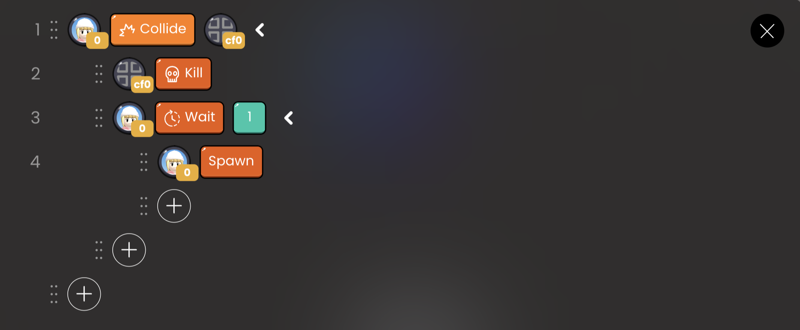

# Avatar API

| API Format | Linked Block |               Function               |
| :--------: | :----------: | :----------------------------------: |
|   Spawn    |      -       | Move to start point object at launch |

## Spawn

On execution, the avatar moves to the start point object.

 

   OOBC Spawn sample code

 

 OOBC Spawn

