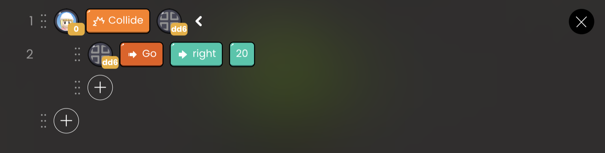
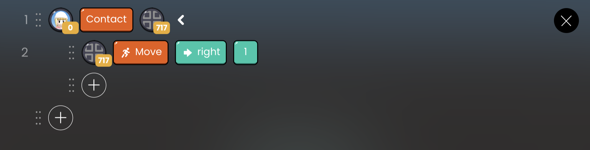

# Event API

| API Format  | Linked Block |                                         Function                                          |
| :---------: | :----------: | :---------------------------------------------------------------------------------------: |
|   Collide   |    Object    |          Run a callback function when a specific target collides with an object           |
| CollideOnce |    Object    |  Executes a callback function when a specific target collides with an object, only once   |
| CollideEnd  |    Object    |            Callback function runs when target on object leaves after collision            |
|   Contact   |    Object    | If the object is in contact after a target crashes, the callback function runs repeatedly |

## Collide

Executes indented code when a specific target collides with an object.

- `object` : Select the object to determine if it crashed.

 

   OOBC Collide sample code

 

   OOBC Collide

## CollideOnce

Executes indented code only once when a specific target collides with an object.

`object` : Select the object to determine if it crashed.

 

   OOBC CollideOnce sample
  code

 

   OOBC
  CollideOnce

## CollideEnd

Executes indented code only once when an object leaves a specific target after a collision.

`object` : Select the object to determine if it crashed.

 

   OOBC CollideEnd sample
  code

 

   OOBC CollideEnd

## Contact

Executes indented code repeatedly if the object is in contact after a specific target crashes.

`object` : Select the object to determine if it crashed.

 

   OOBC Contact sample code

