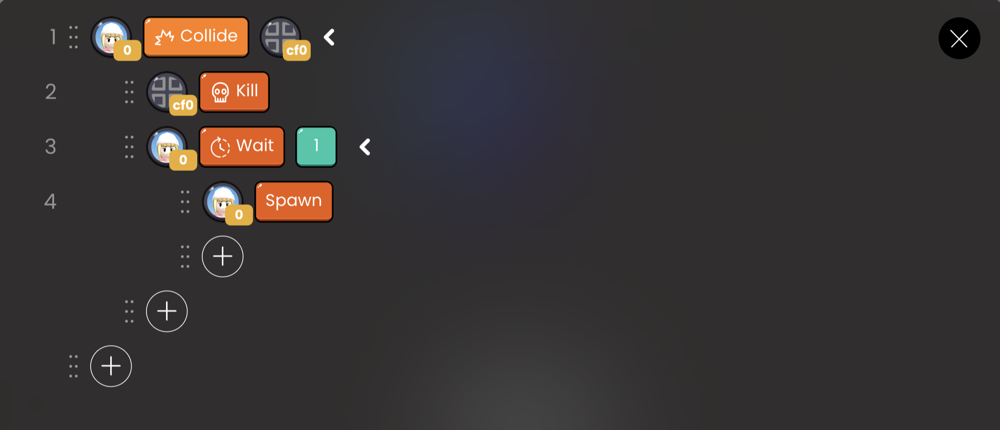

# General API

| API Format | Linked Block |                 Function                  |
| :--------: | :----------: | :---------------------------------------: |
|    Wait    |    number    | Defer code execution for a specified time |

## Wait

### Definition

Delays code execution for a specified amount of time.

- `number`: Enter the number of seconds to defer code execution.

 

 OOBC wait sample code

 

 OOBC wait

