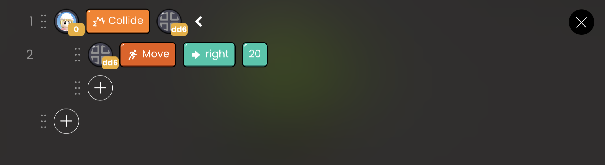

# Translation API

| API Format | Linked Block |                        Function                         |
| :--------: | :----------: | :-----------------------------------------------------: |
|    GoTo    | X:0 Y:0 Z:0  |   Move objects directly to the specified coordinates    |
|     Go     |      x       |      Move as specified to the x-axis of the object      |
|            |      y       |      Move as specified to the y-axis of the object      |
|            |      z       |      Move as specified to the z-axis of the object      |
|    Move    |      x       | Move the object by the specified distance on the x-axis |
|            |      y       | Move the object by the specified distance on the y-axis |
|            |      z       | Move the object by the specified distance on the z-axis |
|            |              |                                                         |

## GoTo

Moves the object directly to the specified coordinates.

- `X:0 Y:0 Z:0`: Enter the x, y, and z-axis coordinates in order.

 

 OOBC GoTo sample code

 

 OOBC GoTo

## Go

Moves the object directly in the specified direction by the value you enter.

`x` :Enter the number of x-axis movement.

`y` : Enter the number of y-axis movement.

`z` : Enter the number of z-axis movement.

`up` : Results such as [Go] [y] [positive] appear.

`down` : Results such as [Go] [y] [negative] appear.

`left` : Results such as [Go] [x] [negative] appear.

`right` : Results such as [Go] [x] [positive] appear.

 

 OOBC Go sample code

 

 OOBC Go

## Move

Moves the object in the specified direction by the value entered.

`x` : Enter the number of x-axis movement.

`y` : Enter the number of y-axis movement.

`z` : Enter the number of z-axis movement.

`up` : Enter the number of upward movement.

- Results such as [Move] [y] [positive].

`down` : Enter the number of downward movement.

- Results such as [Move] [y] [negative] appear.

`left` : Enter the number of leftward movement.

- Results such as [Move] [x] [negative] appear.

`right` : Enter the amount of rightward movement.

- Results such as [Move] [x] [positive] appear.

 

 OOBC Move sample code

 

 OOBC Move

