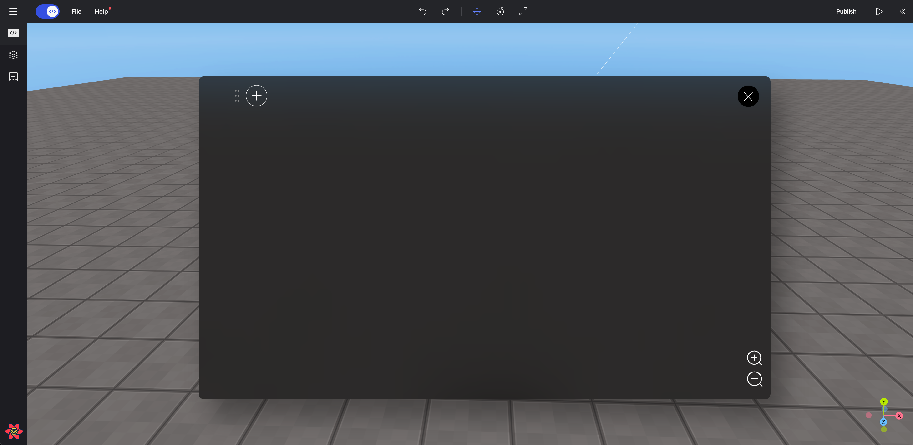

import { Callout } from "nextra/components";

# Block Coding (OOBC)

> Guide for Block Coding

---

<Callout type="error" emoji="️‼️">
  Block coding commands will be continuously added to Redbrick Studios.
</Callout>

 

   Block Coding (OOBC) View

## Overview

In a project created by block coding, you can open a code window by clicking the code button `</>`.

Press the `[+]` button in the code window to begin entering the code.

- Edit
- Voting Translation
