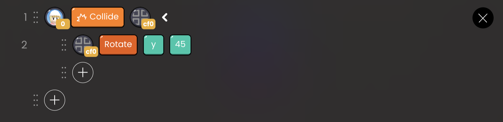
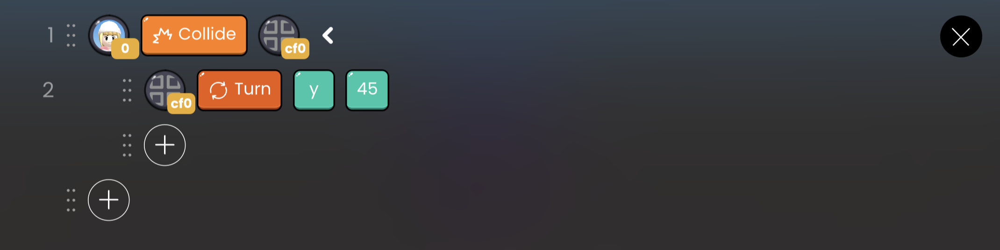

# Rotation API

| API Format | Linked Block |                        Function                        |
| :--------: | :----------: | :----------------------------------------------------: |
|   Rotate   |      x       | Rotate the object as much as you specify on the x-axis |
|            |      y       | Rotate the object as much as you specify on the y-axis |
|            |      z       | Rotate the object as much as you specify on the z-axis |
|    Turn    |      x       |  Turn the object by the specified angle on the x-axis  |
|            |      y       |  Turn the object by the specified angle on the y-axis  |
|            |      z       |  Turn the object by the specified angle on the z-axis  |

## Rotate

Rotate the object immediately by the specified amount in the given direction.

`x` : Enter the amount of rotation on the x-axis.

`y` : Enter the amount of rotation on the y-axis.

`z` : Enter the amount of rotation on the z-axis.

`up` : Results similar to [ Rotate ] [ y ] [ positive ] will appear.

`down` : Results similar to [ Rotate ] [ y ] [ negative ] will appear.

`left` : Results similar to [ Rotate ] [ x ] [ negative ] will appear.

`right` : Results similar to [ Rotate ] [ x ] [ positive ] will appear.

 

   OOBC Rotate sample code

 

   OOBC Rotate

## Turn

Rotates the object in the specified direction slowly by the value entered.

`x` : Enter the number of x-axis rotation.

`y` : Enter the number of y-axis rotation.

`z` : Enter the number of z-axis rotation.

`up` : Results such as [Turn] [y] [positive] appear.

`down` : Results such as [Turn] [y] [negative] appear.

`left` : Results such as [Turn] [x] [negative] appear.

`right` : Results such as [Turn] [x] [positive] appear.

 

 OOBC Turn sample code

 

 OOBC Turn

