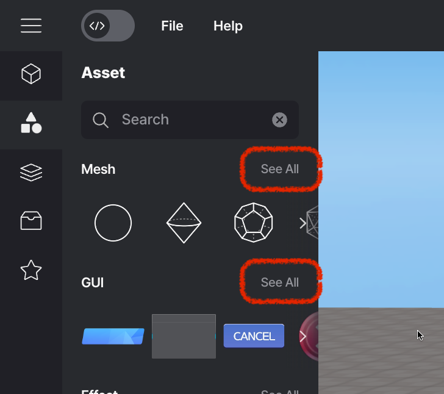
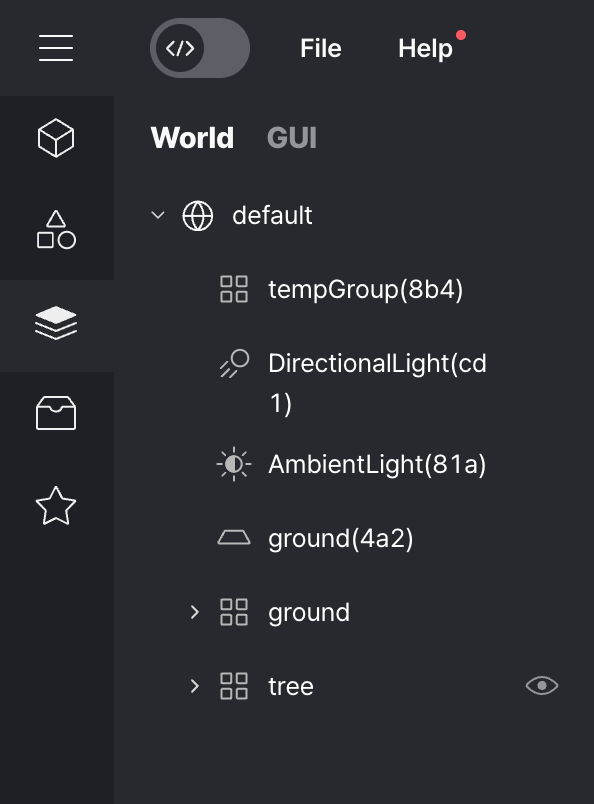

import { Callout } from "nextra/components";
import Image from "next/image";

# Asset Library Panel (Left Panel)

The visual elements that make up the world in Redbrick Studios are called objects.

You can obtain objects through the Asset Library panel after opening it by pressing the `≡` button on the top left.

## Model

Inside of the Model you can find all types of 3D models that you might need for your project.

 

 Model

### Search

You can easily find the desired object using the search function at the top of the panel.

Type the desired word in the search term text box and press the Enter key.

The object that corresponds to the search result appears.

 

 Search

## Asset

The asset refers to the finished model that you import from the library.

 

 Asset

You can click 'see all' to access all.

<Callout type="info" emoji="ℹ️">
  More informations related to Asset can be found [here](./left/asset).
</Callout>
 

 See all

## Layers

Button to expand the Asset Layer and then manipulate objects or the GUI on the Asset Layer.

 

WORLD             |  GUI
:-------------------------:|:-------------------------:
  |  

The left is the Scene Layer, where objects are displayed, and the right is the GUI Layer, where GUIs are displayed.

<Callout type="info" emoji="ℹ️">
  By default, the [following features are available](./left/layer).
</Callout>

## My Asset

In addition to the objects provided by Redbrick Studios,
you can use it by adding your own custom asset.

<Callout type="info" emoji="ℹ️">
  More informations related to My Assets can be found [here](./left/my-asset).
</Callout>

## Script (code script on)

<Callout type="warning" emoji="⚠️"></Callout>
