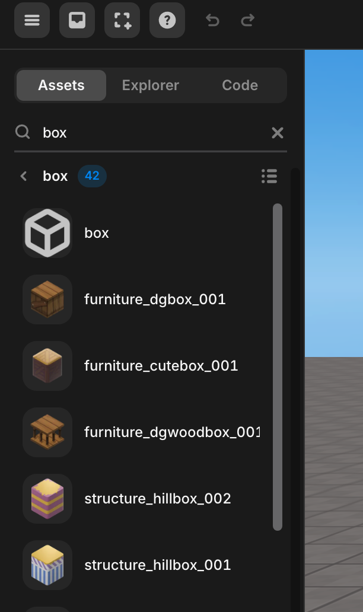

import { Callout } from "nextra/components";
import Image from "next/image";

# Asset Library, Code Panel (Left Panel)

The visual elements that make up the world in Redbrick Studios are called objects.

You can obtain objects through the Asset Library panel, and access the code script after opening it by pressing the `v` button on the top left.

You can also open the lower panel to access the asset library only.

## Model

Inside of the Model you can find all types of 3D models that you might need for your project.

 

 Model

### Search

You can easily find the desired object using the search function at the top of the panel.

Type the desired word in the search term text box and press the Enter key.

The object that corresponds to the search result appears.

 

 Search

## Scenes

In the scenes, you can add a camera, a sponge point, and light.

 

 Scenes

## Elements

In the elements, you can add GUI, effects, mesh, sound, and video.

 

 Elements

<Callout type="info" emoji="ℹ️">
  More informations related to Asset can be found [here](./left/asset).
</Callout>

## Explorer

Click the Explorer button to manipulate the object or GUI.

 

세계             |  GUI
:-------------------------:|:-------------------------:
  |  

The left is the Scene Layer, where objects are displayed, and the right is the GUI Layer, where GUIs are displayed.

<Callout type="info" emoji="ℹ️">
  By default, the [following features are available](./left/layer).
</Callout>

## Code Script

You can open a code script by pressing the Code button

<Callout type="info" emoji="ℹ️">
  **Note:** If you want to know how to add, delete, or rename scripts, check [here] (../../script/start/object).
</Callout>

Code Script

