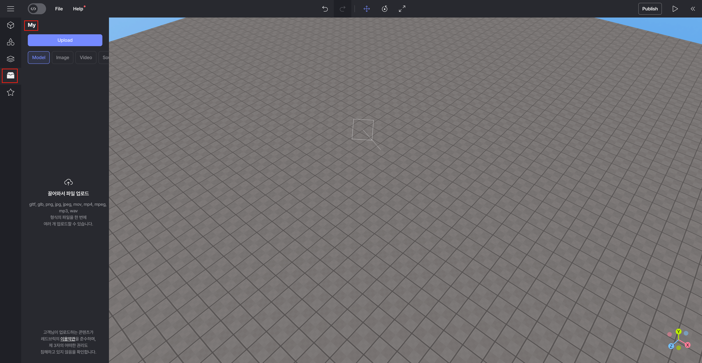
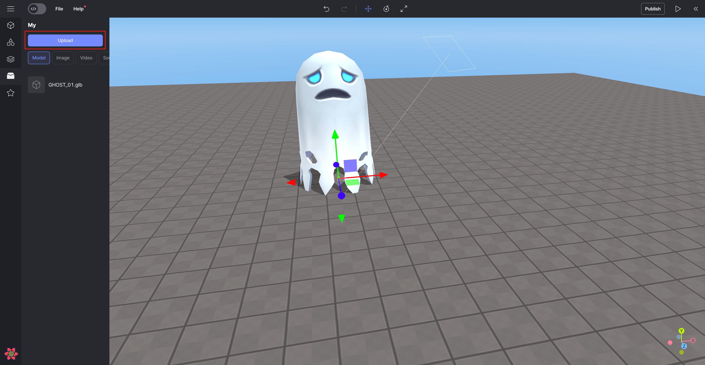

import { Callout } from "nextra/components";

# My Asset

Custom assets can be uploaded and used in Model, Image, Video, and Sound formats.

<Callout type="warning">
  Supports files in the following formats: `gltf, glb, png, jpg, jpeg, mov, mp4,
  mpeg, mp3 and wav`.
</Callout>

## How to use My Asset

Enter the `[My]` category through the left panel.

 

 My Asset

Click the `[Upload]` button to add the desired file.

Select and recall the uploaded object.

<Callout type="info">
  The added files are automatically classified and available on the My > Model,
  Image, Video, and Sound tabs.
</Callout>

 

   Uploading and using files

