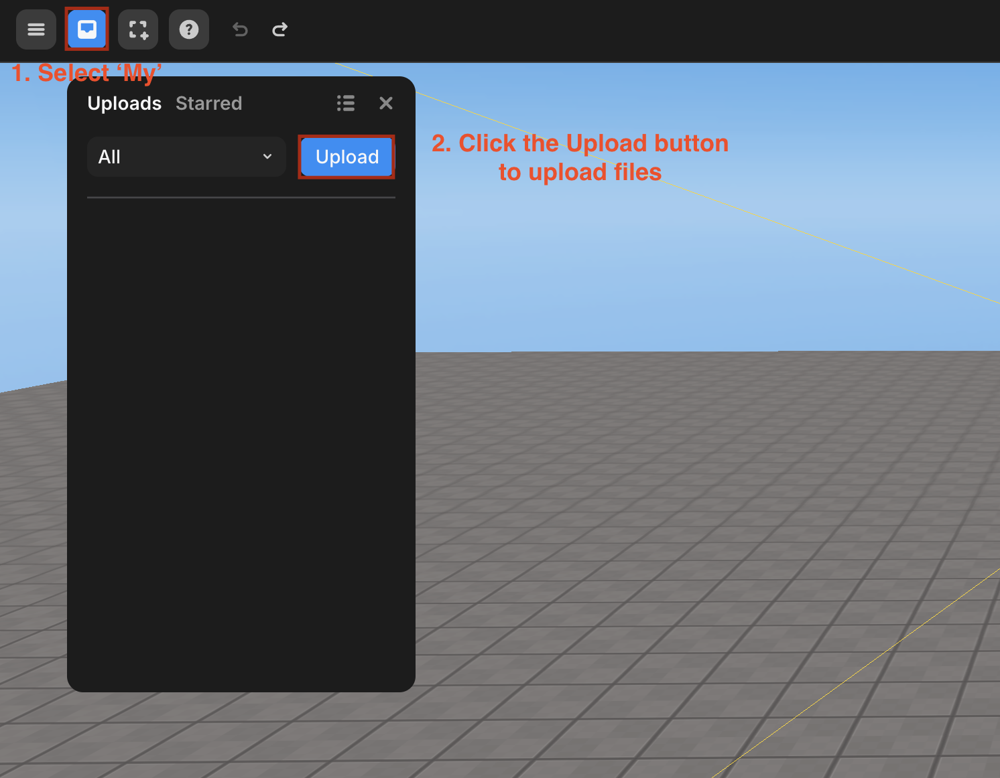
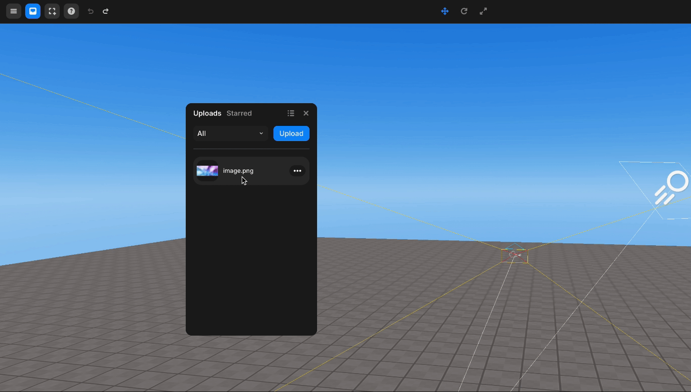

import { Callout } from "nextra/components";

# My Assets

You can upload custom assets in the form of models, images, videos, and sounds.

<Callout type="warning">
  The following file formats are supported: `gltf, glb, png, jpg, jpeg, mov, mp4, mpeg, mp3, wav`.
</Callout>

## How to Use My Assets

Go to the `[My]` category through the left panel and click the upload button to upload the file you want to use.

 

<Callout type="info">
  The uploaded files are automatically categorized and can be accessed in the My > Models, Images, Videos, and Sounds tabs.
</Callout>

You can add the uploaded items to the scene in two ways.

Left-click the item or drag and drop it into the scene to add it as a 3D object, making it a child of WORLD.

 
  
  

Hover over the item and click the three dots that appear, then select Add to GUI to add it as a GUI object, making it a child of GUI.

 
  

For the differences between 3D objects and GUI objects, refer to [this guide](../../../script/start/3d-and-gui-object#differences-between-3d-objects-and-gui-objects).
