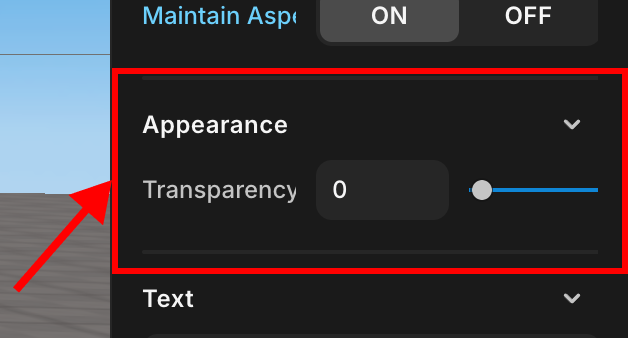

import { Callout } from "nextra/components";

# Appearance

> You can adjust the transparency of the object and set whether it is shadowing.

---

   GUI Appearance

<Callout type="error" emoji="️‼️">
  Only transparency control is currently supported.
</Callout>
