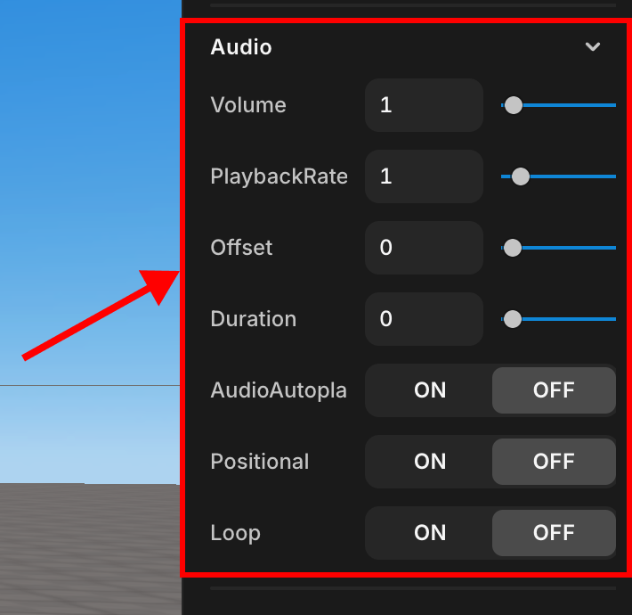

# Audio

> Provides guidance on audio properties.

 

 Audio

You can set the properties of a sound object, such as volume, duration of sound, loop, and positional. Property that exists only in Audio Object.

## Volume

Specifies the volume of the audio.

## PlaybackRate

Specifies the playback speed of the audio.

## Offset

Plays audio from a point past the specified offset.

## Duration

Play audio only as long as you specify.

## AudioAutoplay

Enables sound to play automatically when the scene starts or the corresponding audio object is loaded.

## Positional

Checking the properties changes the volume of audio sounds depending on the distance from the user. Related properties exist.

## Loop

Check the properties to repeat the audio.
