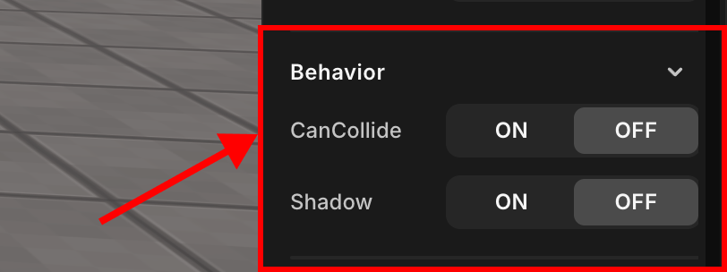

import { Callout } from "nextra/components";

# Behavior

> Set the object's action options, sound, and so on.

 

   Behavior

Depending on the type of object class, different options may be displayed. The properties that exist are as follows.

## CanCollide

Sets the possibility of collision between the object and the avatar. When you turn off the conflict, the avatar passes through the object.

#### Static

<Callout type="info" emoji="ℹ️">
  Only active when CanCollide is checked.

 

   Static

</Callout>
We recommend checking the static property on most objects because checking it creates
a static collider, which can improve playability. However, it should be unchecked
on dynamic objects because the collider remains the same even if the object moves
or disappears.

## Shadow

Enables objects to cast shadows.
