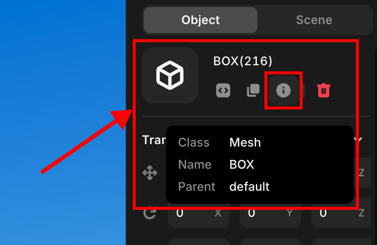

# Data

> The Data tab displays information about the object.

## Title

Objects should have each unique title. We recommend such because if you have multiple objects of the same title it may not behave correctly and may not operate as set.

## Class

Indicates information about which class the object belongs to. By default, this value cannot be changed.

## Name

Displays the name the object has. By default, this value cannot be changed.

## Parent

A value that represents an element that is just one level above the object.

---

   Object data

