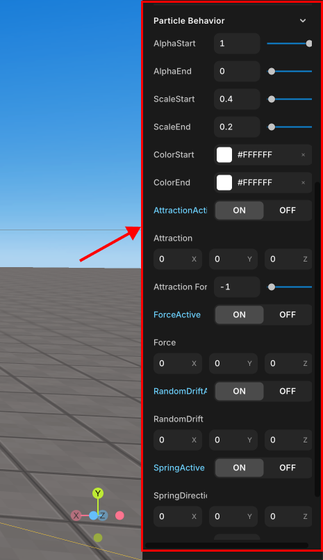

# Emitter & Particle Property

> You can set the effect's emission type (Preset), speed (Radial Speed), and angle (Radial Degree).

## Properties

 

   Emitter &
  Particle Properties

### Emitter Property

- **Preset**: Selects a pre-configured setup for the particle emitter.
- **EmitAmount**: Defines the range for the number of particles emitted. With `min` and `max` numbers.
- **EmitRate**: Sets the rate at which particles are emitted.

### Particle Property

- **Texture**: Allows you to add a texture to the particles by clicking the '+' button.
- **ParticleLife**: Specifies the lifespan of particles.
- **ParticleMass**: Determines the mass of the particles.
- **RadialSpeed**: Controls the speed at which particles move away from the center.
- **RadialDirection**: Specifies the direction of the radial movement using X, Y, Z coordinates.
- **RadialDegree**: Defines the spread of the particles in degrees.

## Particle Behavior

 

   Particle
  Behavior

- **AlphaStart**: The initial transparency of the particles.
- **AlphaEnd**: The ending transparency of the particles.

- **ScaleStart**: The initial size of the particles.
- **ScaleEnd**: The final size of the particles as they approach the end of their lifespan.

- **ColorStart**: The initial color of the particles. The box would typically show the color.
- **ColorEnd**: The final color of the particles. Particles will gradually shift to this color over time.

- **AttractionActive**: A toggle to activate or deactivate attraction forces on the particles.

  - **Attraction**: The direction of the attraction force, specified in X, Y, Z components.
  - **Attraction Force**: The strength of the attraction force.

- **ForceActive**: A toggle to apply an additional force on the particles.

  - **Force**: The direction and strength of the force, specified in X, Y, Z components.

- **RandomDriftActive**: A toggle to apply random movement to the particles.

  - **RandomDrift**: The variability of the drift in each of the X, Y, Z directions.

- **SpringActive**: A toggle to apply spring-like behavior to the particles.
  - **SpringDirection**: The direction of the spring force, specified in X, Y, Z components.
  - **Spring Factor**: The strength of the spring force.
  - **Spring Friction**: Damping on the spring effect to reduce the oscillation over time.
