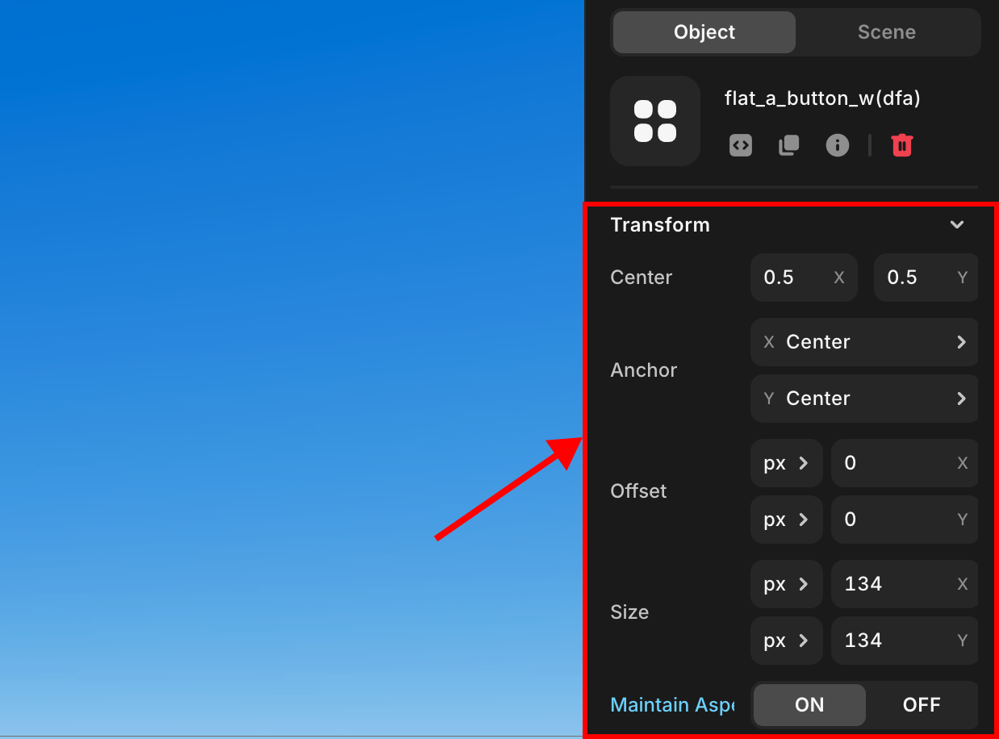

import { Callout } from "nextra/components";

# GUI Transform

> Provides guidance on transforming GUI elements.

---

   GUI Transfrom

If you are placing GUI elements, adjust the position based on Anchor and offset.

---

## Center

Property that specifies the center position of the GUI.

X is expressed as a value between 0 and 1, where 0 is the left end of the GUI and 1 is the right end of the GUI.

Y is expressed as a value between 0 and 1, where 0 is the bottom end of the GUI and 1 is the top end of the GUI.

By default, it is set to 0.5 / 0.5 value corresponding to the median value.

## Anchor

Property that specifies where the center of the GUI will be on the screen.

<Callout type="info" emoji="ℹ️">
  X has three options: Far-Left, Center, and Far-Right, which correspond to the
  X-axis 0%, 50%, and 100% points of the parent element, respectively.
</Callout>

<Callout type="info" emoji="ℹ️">
  Y has three options: Bottom, Center, and Top, and corresponds to 0%, 50%, and
  100% points on the Y axis of the parent element, respectively.
</Callout>

## Offset

Property that specifies how far away the GUI is from the anchor.

Specify X and Y values to have offset by the value specified in each axial direction.

<Callout type="info" emoji="ℹ️">
  There are two units, `px` and `%` (percent).
</Callout>

For px, it has an offset of a fixed pixel value corresponding to the specified value. Available if you need to always have a fixed distance.

For `%`, the x-axis and y-axis will be offset by the specified percentage value relative to the width and height of the parent element, respectively. Because the size of the parent element determines the actual offset size, this can be useful for flexible arrangement based on screen size, or if you want to include a GUI as a child of another GUI to maintain relative offsets.

## Size

Property that specifies the size of the GUI.

Specify X and Y values to have the specified value in each axial direction.

<Callout type="info" emoji="ℹ️">
  There are two units, `px` and `%` (percent).
</Callout>

For PX, it has a fixed pixel value that corresponds to the value you specify. Available
if you want to place a fixed-size GUI.

For `%`, the x-axis and y-axis will be sized by the specified percentage value relative to the width and height of the parent element, respectively. Because the size of the parent element determines the actual size, this can be useful for flexible arrangement based on screen size, or if you want to include a GUI as a child of another GUI to maintain relative size.

## MaintainAspectRatio

The value that determines whether the unique aspect ratio of the GUI is maintained.

It is checked by default and maintains the aspect ratio if checked. By maintaining the ratio, either X or Y can be ignored.

When unchecked, the aspect ratio is ignored and the GUI changes to the size you specify.
