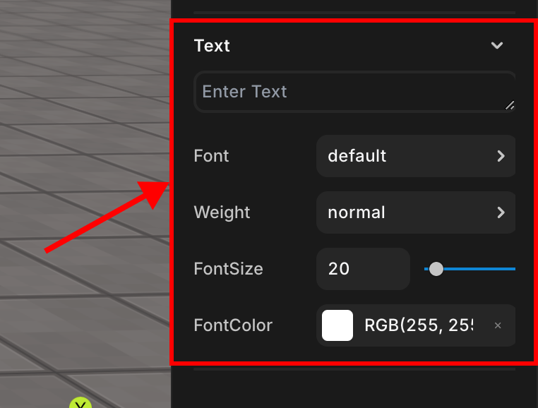

import { Callout } from "nextra/components";

# Text

> You can set the text properties of a GUI object.

 
Text properties
 

You can configure text properties such as text content, font, weight, size, and color.  

These properties exist only for GUI objects.

## TextInput

Enter the text content to be displayed by default.  

The text will continuously be displayed with the entered value until it is modified using the [`.setText()`](../../../../script/api/sprite#settext) method.

## Font

Specify the font of the text.

## Weight

Specify the weight of the text.

## FontSize

Specify the size of the text.

## FontColor

Specify the color of the text.