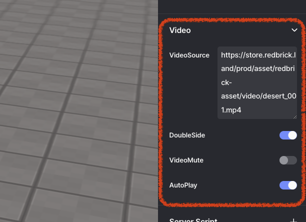

# Video

> Provides guidance on video properties.

You can set the properties of a video object, such as volume, duration, loop, and positional properties. Note that some properties exist only for the Audio Object.

 

 Video

## Double Side

Enables visibility on both sides of the object.

## Video Mute

Mutes the video object.

## Auto Play

The video object will play automatically if this is on.
