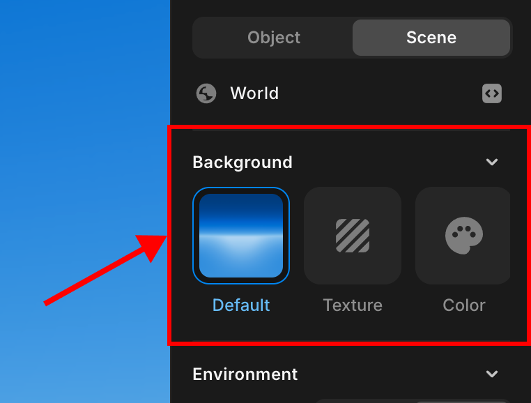
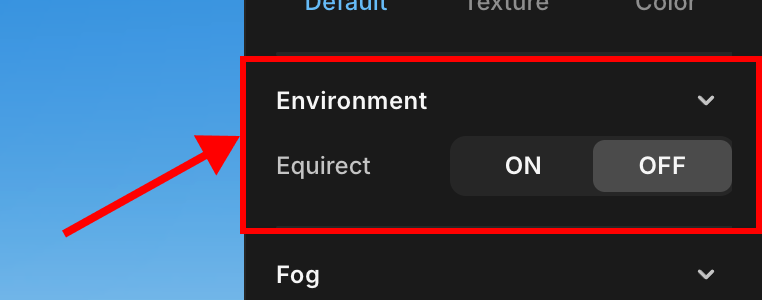
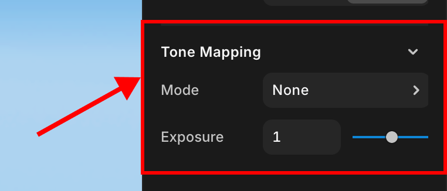
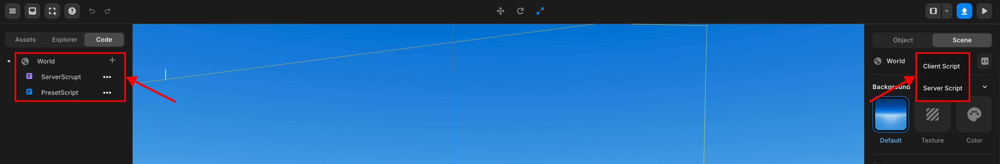

# Scene

Background, environment, fog, tone mapping, post processing, and script management.

## Background

You can change the color of the background or add the image you want.

 

   Background

## Environment

 

   Environment

## Fog

Press the FogActive toggle to add the desired color and shape of fog to the scene.

 

   Fog

## Tone Mapping

Function that adjusts the brightness and color of the scene. You can create the desired level of brightness by adjusting the mode and exposure value.

 

   Tone Mapping

## Post Processing

You can add a post processing to the scene to make the scene smoother and more realistic.

Post processing include SSAO, Bloom, God-rays, HueSaturation, and Brightness Contrast.

- **SSAO**: The effect of making shadows cast naturally where objects are placed close to each other in the scene (e.g., corners or joints).
- **Bloom**: It creates the effect of spreading light in bright areas of the screen.
- **God-rays**: An effect that looks like a pillar of light, it is used to express the light that sunlight shines through the leaves or passes through a dusty space.
- **HueSaturation**: It is the effect of adjusting the color tone and saturation.
- **BrightnessContrast**: Brightness is the effect of controlling the overall brightness of the screen, and contrast is the effect of highlighting the difference in bright and dark areas.

 

   Post Processing

## Script Management

You can create server and client scripts.

 

   Script Management

