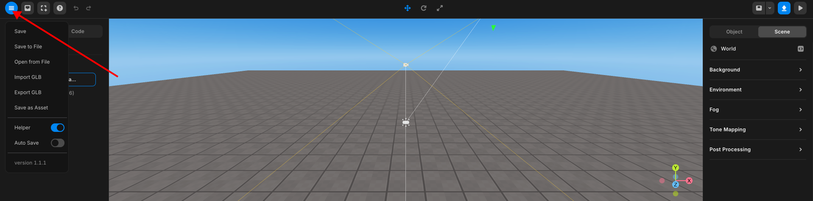
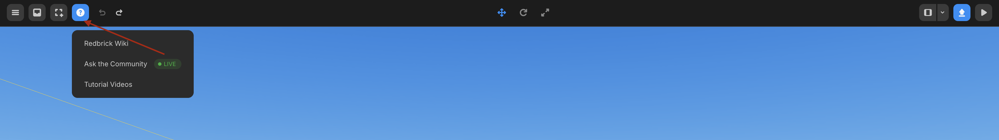
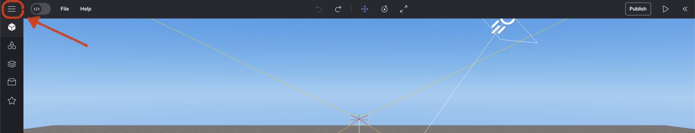
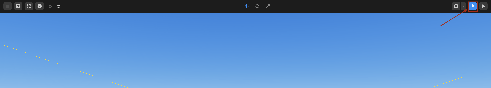
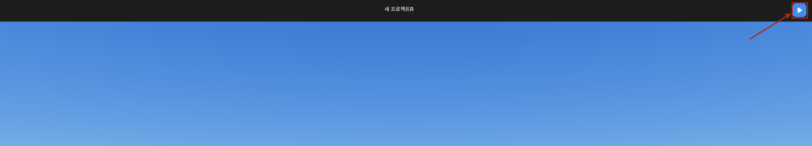

import { Callout } from "nextra/components";

# Top Panel

## File Menu

Press **File Menu** to access all the features listed down below.

From here, you can save files, publish them, save the object as an asset, and more.

|    **List**    |               **Function**               |
| :------------: | :--------------------------------------: |
|      Save      |               Save Project               |
|  Save to File  |           Save project as JSON           |
| Open from File |         Import project from JSON         |
|   Import GLB   |                Import GLB                |
|   Export GLB   |           Save project as GLB            |
| Save as Asset  |      Save selected object as asset       |
|   Help    | Show light, camera position, etc |
|   Auto Save    | On/Off button for automated project save |

File Menu

## My Assets

You can upload custom assets in the form of models, images, videos, and sounds for use.

<Callout type="warning">
  Supported file formats: `gltf, glb, png, jpg, jpeg, mov, mp4, mpeg, mp3, wav`.
</Callout>

<Callout type="error" emoji="️🚫">
  If you put `gltf` and `glb` files that have gone through Paint 3D, the project file will be ruined, so never put them in.
</Callout>

### How to Use My Assets

Go to the `[My]` category through the left panel, and click the upload button to upload the file you want to use.

 

<Callout type="info">
  Uploaded files are automatically categorized and can be accessed from the My > Models, Images, Videos, Sounds tabs.
</Callout>

You can add uploaded items to the scene in two ways:  
Add as a 3D Object to the scene or add as a GUI Object to the scene.  
For the differences between 3D objects and GUI objects, refer to [this guide](../../script/start/3d-and-gui-object#differences-between-3d-objects-and-gui-objects).

### Adding to the Scene as a 3D Object

Click the item or drag and drop it into the scene to add it as a 3D object, making it a child of the WORLD.

 
  Click the item to add as a 3D Object
   
  Drag and drop the item into the scene to add as a 3D Object

### Adding to the Scene as a GUI Object

Hover over the item and click the three dots that appear, then select Add to GUI to add it as a GUI object, making it a child of the GUI.  
Only images or GUI files can be added as GUI objects.

 
  Adding to the scene as a GUI Object

## 템플릿

<Callout type="error" emoji="️🚫">
  It will be added when the update is complete.
</Callout>

## Help Menu

If you need support, press the **Help Menu** button, where you can access Discord and Wiki to get support.

Help Menu

## Undo & Redo

The top menu contains buttons that allow you to undo and redo actions.

<Callout>
Additionally, you can utilize keyboard shortcuts for undoing and redoing.

- To undo: `⌘ (CTRL) + Z`
- To redo: `⌘ (CTRL) + SHIFT + Z`

</Callout>

Undo & Redo Buttons

## Object Setting Button

The top menu contains buttons that allow you to move, rotate, and resize objects. Explore the various ways to set up an object using these functionalities.

<Callout>
  More information about object setting can be found [here](./top/set-object)
</Callout>

Object Setting Buttons

## Panel Button

You can access the desired panel by pressing the 'v' button at the top right.
Press Left to open the asset library, code panel, and Right to open the property panel.
Press Boston to open only the asset library below.

<Callout>
  More information about the Asset Library, Code can be [found here](./left).
</Callout>

<Callout>
  More information about the Property can be [found here](./right).
</Callout>

Panel

Show All Panel

## Publish

Press the **Publish** button in the top right corner to publish your project on Redbrick.

Publish Button

## Play & Stop Buttons

Press the `[▶️]` button at the top center to enter Run Mode.

Play Button

Press the `[■]` button at the top center to revert to Edit Mode.

Stop Button

