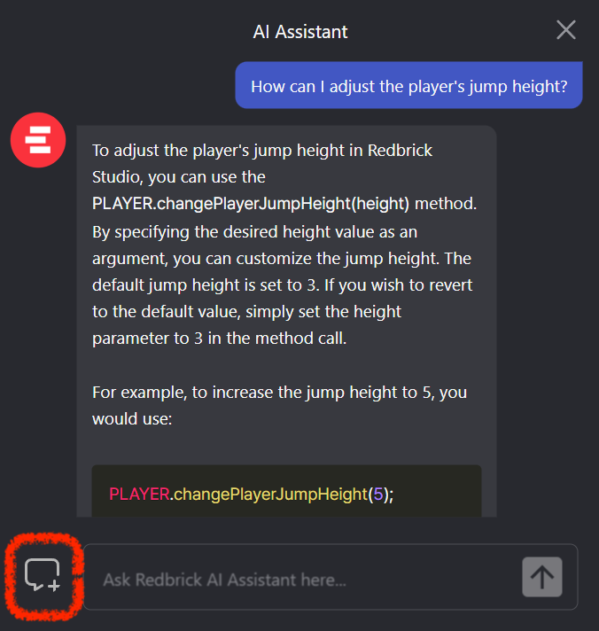

import { Callout } from "nextra/components";
import { Steps } from "nextra/components";
 
# How to use the AI Assistant (GPT) properly

_To effectively use the AI Assistant (GPT), it's crucial to ask clear and
specific questions. Providing context, background information, and sample code
where applicable can greatly improve the quality of the response. Here's a
detailed guide on how to make the most out of the AI Assistant, along with a
few examples:_

<Callout type="warning">
  Sometimes, GPT's reply might not be perfect.It's important for users to
  understand which parts of GPT's reply are usable and which are not.
</Callout>

<Callout type="warning">
  GPT remembers previous conversation contents, so it might provide answers related to previous questions.  
  Therefore, if you want to ask a new question that is not related to previous ones, it's better to use the "New Chat" button.  
  <br/>
  <center>New Chat Button</center>
</Callout>

<Steps>

### Ask Clear and Specific Questions

The more specific your question, the more precise the answer will be. Avoid vague questions to ensure you receive relevant responses.

<Callout> 
**Example:** Instead of "How do I fix this code?", ask "How can I resolve the `SyntaxError: Unexpected token` in this JavaScript code?"

```js
const cube = WORLD.getObject("Cube");
// your code with errors
cube.position.x == 10;
```

</Callout>

### Provide Context and Background Information

Explaining the problem or topic in detail, including any relevant background information, helps the assistant understand your needs better.

<Callout> 
   **Example:** "I'm building a 3D scene in Redbrick Studio and need to detect when the player collides with a specific object. How can I use the `onCollide` method for this?"

```js
const player = PLAYER;
const target = WORLD.getObject("Target");

function Start() {
  player.onCollide(target, () => {
    console.log("Collision detected!");
  });
}
```

</Callout>

### Include Sample Code When Possible

If your question involves code, including a snippet can help the assistant provide a more accurate and relevant answer.

<Callout> 
**Example:** "Can you help me optimize this function that displays a countdown timer using Redbrick's Timer module?"

```js
const timer = new REDBRICK.Timer();
const display = GUI.getObject("TimerDisplay");

function Start() {
  timer.start();
}

function Update(dt) {
  const time = Math.floor(timer.getTime());
  display.setText(time);
}
```

</Callout>

### Mention Desired Output or Format

Mentioning the desired outcome or format of the response can help the AI tailor its answer more closely to your needs.

<Callout> 
   **Example:** "I need help in retrieving an object by its title using Redbrick's `WORLD.getObject` method. How can I do this?"

</Callout>

### State Your Experience Level

Informing the assistant of your familiarity with the topic can help it craft a response that is neither too simplistic nor overly complex.

<Callout> 
   **Example:** "I'm a beginner with Redbrick Studio scripting. Can you explain how to create an object that moves up and down continuously using the `move` method?"

```js
const obj = WORLD.getObject("Box");
let direction = 1;

function Update(dt) {
  obj.position.y += direction * dt;
  if (obj.position.y > 5 || obj.position.y < 0) {
    direction *= -1;
  }
}
```

</Callout>

### Highlight Key Constraints

Identifying any specific constraints or requirements can guide the AI to offer solutions that fit within your parameters.

<Callout> 
   **Example:** "I need to animate an object in Redbrick Studio to move in a circle path. How can I achieve this without using complex math?"

```js
const obj = WORLD.getObject("Box");
let angle = 0;

function Update(dt) {
  angle += dt;
  obj.position.x = Math.cos(angle) * 5;
  obj.position.z = Math.sin(angle) * 5;
}
```

</Callout>

### Follow Up for Clarification

After receiving a response, don't hesitate to ask follow-up questions for further details or clarification.

<Callout> 
   **Example:** "Thanks for the code to animate the object in a circular path. Can you explain how to make the movement smoother?"

```js
const obj = WORLD.getObject("Box");
let angle = 0;
const speed = 0.01;

function Update(dt) {
  angle += speed * dt;
  obj.position.x = Math.cos(angle) * 5;
  obj.position.z = Math.sin(angle) * 5;
}
```

</Callout>

</Steps>

By focusing on clarity, context, specific requirements, and follow-up questions, you can enhance the quality of responses from the AI Assistant.
