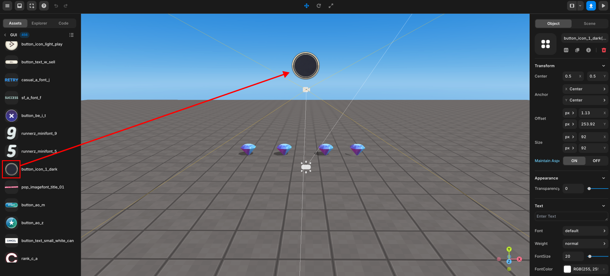

import { Callout } from "nextra/components";
import { Steps } from "nextra/components";
import { Tabs } from "nextra/components";

# Make it count on the screen when an item is acquired

<Steps>
### Select your desired GUI you want

Select the desired GUI and put it to scene.

<br />
<center> Place GUI </center>

### Code

<Tabs items={["example 1", "example 2"]} defaultIndex="0">
    <Tabs.Tab>
        <Callout type="info">
            Here's a basic example of how to do it. For an enhanced solution, refer to Example 2 👉🏼.
        </Callout>
        ```js showLineNumbers filename="PresetScript" {8-10, 21-22, 26-27, 31-32, 36-37, 41-42}
        const diamond0 = WORLD.getObject("diamond0");
        const diamond1 = WORLD.getObject("diamond1");
        const diamond2 = WORLD.getObject("diamond2");
        const diamond3 = WORLD.getObject("diamond3");
        const diamond4 = WORLD.getObject("diamond4");

        //intialize gui
        const showpoint = GUI.getObject("guiBoardTitle");
        let diamondCount = 0;
        showpoint.setText(diamondCount);

        function Start() {
            (async () => {
                const avatar = await REDBRICK.AvatarManager.createDefaultAvatar();
                const camera = WORLD.getObject("MainCamera");
                const followingCamera = avatar.setFollowingCamera(camera);
                avatar.setDefaultController();

                diamond0.onCollide(avatar, () => {
                    diamond0.kill();
                    diamondCount += 1;
                    showpoint.setText(diamondCount);
                });
                diamond1.onCollide(avatar, () => {
                    diamond1.kill();
                    diamondCount += 1;
                    showpoint.setText(diamondCount);
                });
                diamond2.onCollide(avatar, () => {
                    diamond2.kill();
                    diamondCount += 1;
                    showpoint.setText(diamondCount);
                });
                diamond3.onCollide(avatar, () => {
                    diamond3.kill();
                    diamondCount += 1;
                    showpoint.setText(diamondCount);
                });
                diamond4.onCollide(avatar, () => {
                    diamond4.kill();
                    diamondCount += 1;
                    showpoint.setText(diamondCount);
                });

            })();
        }
        ```
    </Tabs.Tab>
    <Tabs.Tab>

        Here's a slightly improved example of usage, minimizing redundant lines.
        ```js showLineNumbers filename="PresetScript" {2-4, 26-27}
        //intialize gui
        const showpoint = GUI.getObject("guiBoardTitle");
        let diamondCount = 0;
        showpoint.setText(diamondCount);

        function Start() {
            (async () => {
                const avatar = await REDBRICK.AvatarManager.createDefaultAvatar();
                const camera = WORLD.getObject("MainCamera");
                const followingCamera = avatar.setFollowingCamera(camera);
                avatar.setDefaultController();

                //call function
                collisionSetUp(avatar);

            })();
        }

        function collisionSetUp(avatar) {
        // since we have 5 diamonds
            for (let i = 0; i < 5; i++) {
                const diamond = WORLD.getObject("diamond" + i);

                diamond.onCollide(avatar, () => {
                    diamond.kill();
                    diamondCount += 1;
                    showpoint.setText(diamondCount);
                });
            }
        }
        ```
    </Tabs.Tab>

</Tabs>

<br />
<center> GUI display </center>
</Steps>
