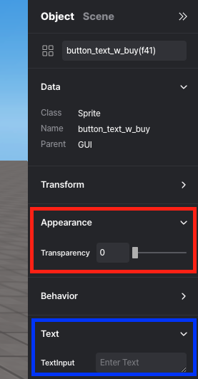
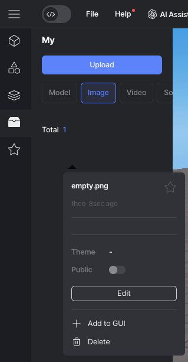

import { Callout } from "nextra/components";
import { Steps } from "nextra/components";
import { Tabs } from "nextra/components";

# Frequently asked question

<Steps>
### Why doesn't `.onCollide()` work?

**Make sure you turned on Physics Body**

<Callout type="error" icon="‼️">
  Don't forget to check Body in the object's properties panel to use methods
  like `onCollide`!
  <div style={{ textAlign: "center" }}>
    <center>
       Physics -> Body
    </center>
  </div>
</Callout>

### How can I rename a Script?

**Edit from property panel**

<Callout type="info">
  You can **add/edit/delete** scripts from the Properties panel of the object.
  You can also rename the script.
  <br />
  <center> Rename </center>
</Callout>

### How do I create a retry button?

Create initialization function, where you put all of your intializion code whenever game starts. And use it whenever you want to restart the game.

```js showLineNumbers filename="example restart" {5, 7-12, 18-20}
let score = 0;
const scoreGUI = GUI.getObject("score_gui");

const startButton = GUI.getObject("start_button");
const restartButton = GUI.getObject("restart_button");

function gameStart() {// Function to restart the game
  PLAYER.spawn();
  score = 0;
  scoreGUI.setText = score;
  // Add other parts that need initialization or setup
}

startButton.onClick(() => {
  gameStart(); //start
});

restartButton.onClick(() => {
  gameStart(); //restart all values
});
```

### How do I create a function to pause the game?

Create a custom function to pause the game, and use that function whenever you need to pause the game.

```js showLineNumbers filename="example game pause" {8-12, 14-17}
const timer = new REDBRICK.Timer();

timer.start();

const pauseButton = GUI.getObject("pause_button");
const playButton = GUI.getObject("play_button");

function gamePause() { // Function to pause the game
  PLAYER.changePlayerSpeed(0);
  timer.pause();
  // Add any other necessary pause operations
};

function gamePlay() { // Function to resume the paused game
  PLAYER.changePlayerSpeed(1);
  timer.resume();
};

pauseButton.onClick(() => {
  gamePause(); // Pause the game
});

playButton.onClick(() => {
  gamePlay(); // Resume the game
});
```

### The changes to the object's position and rotation are not being applied.

Check if the physics body is enabled.

<Callout type="info">
  <div style={{ textAlign: "center" }}>
    <center>
       Physics -> Body
    </center>
  </div>
  Use `body.needUpdate` to update the Physics body when it's **turned on**.
  Update it everytime whenever object body position is changed.
</Callout>
<Callout type="warning">
  You don't need to do this if the Physics body is **turned off**.
</Callout>

```js showLineNumbers {9}
const trash = WORLD.getObject("trash");

function Start() {
  trash.onCollide(avatar, handleTrashCollision);
}

function Update(dt) {
  if (trash.body) {
    trash.body.needUpdate = true; //Use body.needUpdate to update
  }
}
```

### How do I change the background color?

Changing the background color in your project can be easily accomplished using the `WORLD.background` property and the `THREE.Color()` function from [Three.js](https://threejs.org/docs/index.html?q=color#api/en/math/Color). Below are various methods you can use to specify colors.

<Callout type="info">
  Choose one of the methods listed below to set your background color.
</Callout>

```js showLineNumbers filename="Background change"
//Hexadecimal color (recommended)
WORLD.background = new THREE.Color(0xff0000);

//RGB string
WORLD.background = new THREE.Color("rgb(255, 0, 0)");
WORLD.background = new THREE.Color("rgb(100%, 0%, 0%)");

//X11 color name - all 140 color names are supported.
//Note the lack of CamelCase in the name
WORLD.background = new THREE.Color("skyblue");

//HSL string
WORLD.background = new THREE.Color("hsl(0, 100%, 50%)");

//Separate RGB values between 0 and 1
WORLD.background = new THREE.Color(1, 0, 0);
```

### How do I change the avatar's jump height?

To change the jump height of the avatar or player, use `PLAYER.changePlayerJumpHeight(3)`. The default jump height is set to 3.

### How do I switch to first-person view?

To switch to first-person view, `use camera.useFPS()`. To switch back to third-person view, use `camera.useTPV()`.

### What does this error mean?

- **TypeError**: This error occurs when an operation is performed on a value of an inappropriate type. For example, if you try to perform a mathematical operation on a string instead of a number, you'll get a `TypeError`.

- **SyntaxError**: This error occurs when the code contains invalid syntax. It means there is a mistake in the code structure, such as missing parentheses, unmatched braces, or incorrect indentation, preventing the code from being parsed correctly.

### How do I move the avatar?

If you want the avatar to move along with moving objects it steps on, you can use the function `.changeAxisSpeed(x, y, z)`. This function allows you to set the movement speed for the avatar along the x, y, and z axes.

### Why isn't my camera properties change working?

Updates the camera projection matrix. Must be called after any change of parameters (`.fov`, `.far`, `.near`).

### How Do I Change the Camera?

To switch from Camera 1 to Camera 2, simply use the command `camera2.activate()`. If you want to switch to a different camera, use `otherCamera.activate()`.

### How can I display only text?

Here are two ways.

<Callout type="info">
  first way  
  <div style={{ textAlign: "center" }}>
    <center>
       Properties panel for GUI objects -> Appearance -> Transparency  
      Properties panel for GUI objects -> Text -> TextInput
    </center>
  </div>
  Create any GUI element, then adjust the Transparency value to 0 to make it transparent.  
  After that, when you enter text, only the text will be visible, not the GUI's image.
</Callout>

<Callout type="info">
  second way  
  <div style={{ textAlign: "center" }}>
    <center>
       left panel -> My -> Upload transparent PNG file -> Add to GUI
    </center>
  </div>
  Upload a transparent PNG file, then enter text to use it.
</Callout>

### I want to bring and use variables and functions declared in another script

Use [GLOBAL](https://wiki.redbrick.land/en/script/start/global-objects#global).

Even though I used GLOBAL, I can't import variables and functions from other scripts?   
Check if you've coded with attention to [flow control](https://wiki.redbrick.land/en/script/start/flow-control).

</Steps>
