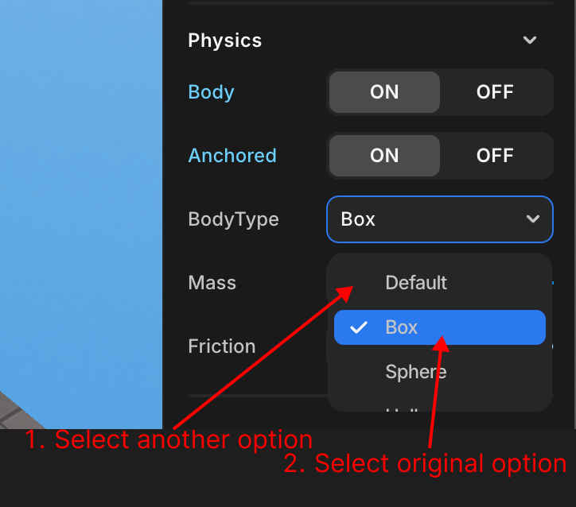
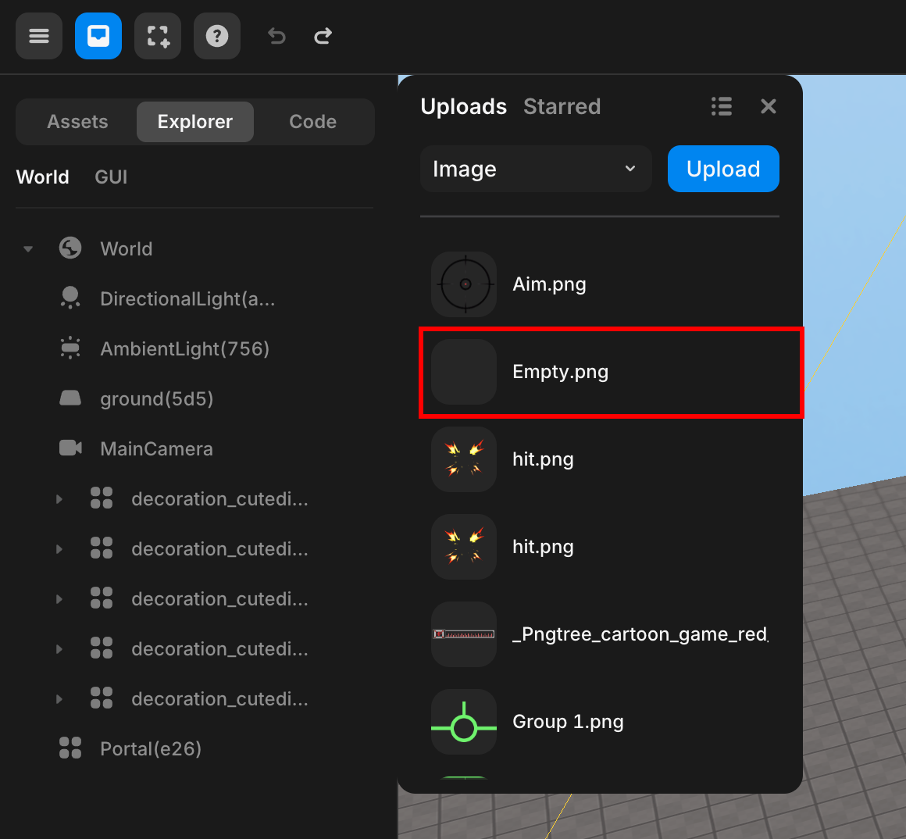
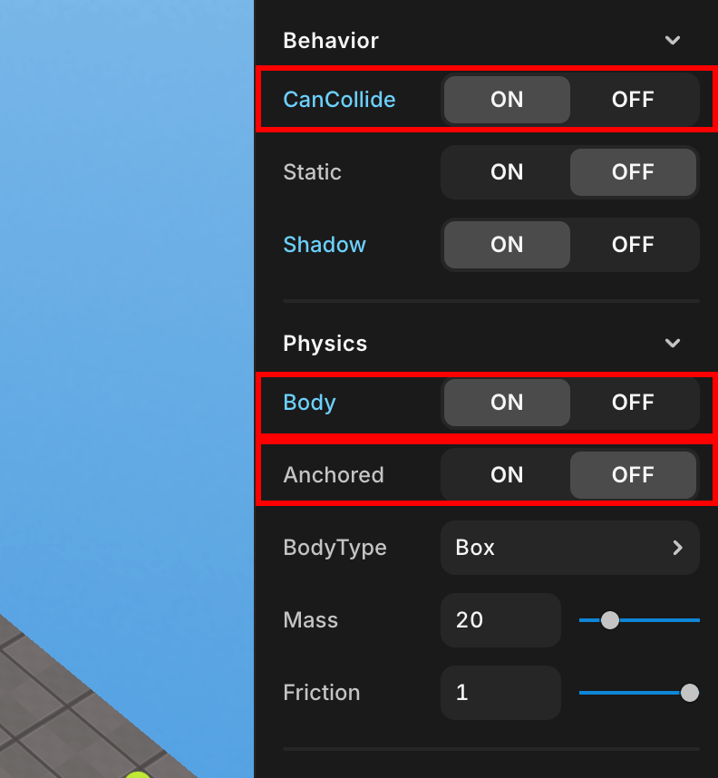

import { Callout } from "nextra/components";
import { Steps } from "nextra/components";
import { Tabs } from "nextra/components";

# Frequently asked question

<Steps>

### If the Character is Slow, Lagging, or Floating

<Callout type="warning">
Please visit this [link](https://threejs.org/examples/#webgl_animation_keyframes) to check if the animation runs smoothly.  
If it lags, follow the steps below.
</Callout>
<br/>

1. Chrome settings -> Search for ‘acceleration’ -> Check ‘Use hardware acceleration’ -> Restart Chrome.
2. If it still doesn't work, clear the cache, close all windows, and reopen them.
3. If it still doesn't work, restart your PC.
4. If it still doesn't work, please uninstall and reinstall Chrome.

<Callout type="info">
  <br/>
  <center>
    Enable hardware acceleration in Chrome
  </center>
</Callout>

<Callout type="error">
If the problem persists,  
it may be due to missing or outdated graphics drivers on your computer.  
Please check if your graphics drivers are installed and, if they are, ensure they are updated.
</Callout>

### The GUI doesn't display correctly when the screen size changes

Did you set the size and offset properties of the GUI object to px?  
Learn about the px and % units [here](../script/start/percent-and-px-unit.mdx).

### Why doesn't `.onCollide()` work?

**Make sure you turned on Physics Body**

<Callout type="error" icon="‼️">
  Don't forget to check Body in the object's properties panel to use methods
  like `onCollide`!
  <div style={{ textAlign: "center" }}>
    <center>
       Physics > Body
    </center>
  </div>
  <br/>
  <br/>
  If it still doesn't work, try changing the object's Physics -> Body -> BodyType to a different option, then switch it back to the original option and test again.  
  <br/>
  <center>
    
  </center>

</Callout>

### How can I rename a Script?

**Edit from property panel**

<Callout type="info">
  You can **add/edit/delete** scripts from the Properties panel of the object.
  You can also rename the script.
  <br />
  <center> Rename </center>
</Callout>

### How to Create a Restart Function?

Currently, Redbrick Studio does not have a dedicated function to restart or reset the game.  
However, you can achieve a similar effect with a custom function.  
For more details, please refer to [this guide](../snippet/game-flow/reset-game.mdx).

### How to Create a Pause Function?

Currently, Redbrick Studio does not have a dedicated function to pause the game.  
However, you can achieve a similar effect with a custom function.  
For more details, please refer to [this guide](../snippet/game-flow/pause-game.mdx).


### The changes to the object's position and rotation are not being applied.

Check if the physics body is enabled.

<Callout type="info">
  <div style={{ textAlign: "center" }}>
    <center>
       Physics > Body
    </center>
  </div>
  Use `body.needUpdate` to update the Physics body when it's **turned on**.
  You should Update it everytime whenever object body position is changed.
</Callout>
<Callout type="warning">
  You don't need to do this if the Physics body is **turned off**.
</Callout>

```js showLineNumbers {9}
const trash = WORLD.getObject("trash");

function Start() {
  trash.onCollide(avatar, handleTrashCollision);
}

function Update(dt) {
  if (trash.body) {
    trash.body.needUpdate = true; //Use body.needUpdate to update
  }
}
```

### How do I change the background color?

Changing the background color in your project can be easily accomplished using the `WORLD.background` property and the `THREE.Color()` function from [Three.js](https://threejs.org/docs/index.html?q=color#api/en/math/Color). Below are various methods you can use to specify colors.

<Callout type="info">
  Choose one of the methods listed below to set your background color.
</Callout>

```js showLineNumbers filename="Background change"
//Hexadecimal color (recommended)
WORLD.background = new THREE.Color(0xff0000);

//RGB string
WORLD.background = new THREE.Color("rgb(255, 0, 0)");
WORLD.background = new THREE.Color("rgb(100%, 0%, 0%)");

//X11 color name - all 140 color names are supported.
//Note the lack of CamelCase in the name
WORLD.background = new THREE.Color("skyblue");

//HSL string
WORLD.background = new THREE.Color("hsl(0, 100%, 50%)");

//Separate RGB values between 0 and 1
WORLD.background = new THREE.Color(1, 0, 0);
```

### How do I change the avatar's jump height?

To change the jump height of the avatar or player, use [`PLAYER.changePlayerJumpHeight(height)`](../script/api/avatar#changePlayerJumpHeight). The default jump height is set to 3.

### How do I switch to first-person view?

To switch to first-person view, [`camera.useFPS()`](../script/api/perspective-camera#usefps). To switch back to third-person view, use [`camera.useTPV()`](../script/api/perspective-camera#usetpv).  
however, `.useFPS()` and `useTPV()` only work if the [`.setFollowingCamera()`](../script/api/avatar#setfollowingcamera) method is applied to the avatar.  
For more information about the camera, see [here](../script/built-in/three/perspective)

### What does this error mean?

- **TypeError**: This error occurs when an operation is performed on a value of an inappropriate type. For example, if you try to perform a mathematical operation on a string instead of a number, you'll get a `TypeError`.

- **SyntaxError**: This error occurs when the code contains invalid syntax. It means there is a mistake in the code structure, such as missing parentheses, unmatched braces, or incorrect indentation, preventing the code from being parsed correctly.

### How do I move the avatar?

If you want the avatar to move along with moving objects it steps on, you can use the function [`.changeAxisSpeed(x, y, z)`](../script/api/avatar#changeaxisspeed). This function allows you to set the movement speed for the avatar along the x, y, and z axes.

### Why isn't my camera properties change working?

If you have modified the parameters of the camera (`.fov`, `.far`, `.near`) through code within the script, you must use [`.updateProjectionMatrix()`](../script/built-in/three/perspective#updateprojectionmatrix) to immediately apply the changed values.  

### How Do I Change the Camera?

You can easily switch using [`.activate()`](../script/api/perspective-camera#activate).  
To switch from Camera 1 to Camera 2, use the `camera2.activate()` command.  
To switch to another camera, use `otherCamera.activate()`.

### How can I display only text?

Here are two ways.

<Callout type="info">
  first way  
  <div style={{ textAlign: "center" }}>
    <center>
       Properties panel for GUI objects -> Appearance -> Transparency  
      Properties panel for GUI objects -> Text -> TextInput
    </center>
  </div>
  Create any GUI element, then adjust the Transparency value to 0 to make it transparent.  
  After that, when you enter text, only the text will be visible, not the GUI's image.
</Callout>

<Callout type="info">
  second way  
  <div style={{ textAlign: "center" }}>
    <center>
       left panel -> My -> Upload transparent PNG file -> Add to GUI
    </center>
  </div>
  Upload a transparent PNG file, then enter text to use it.  
  For instructions on how to upload user files, refer to [this guide](../engine/operate/left/my-asset.mdx).
</Callout>

### I want to bring and use variables and functions declared in another script

Use [GLOBAL](https://wiki.redbrick.land/en/script/start/global-objects#global).

Even though I used GLOBAL, I can't import variables and functions from other scripts?   
Check if you've coded with attention to [flow control](https://wiki.redbrick.land/en/script/start/flow-control).

### I want to add and use my own files in addition to the assets and images in the studio

Use My Assets.  
For instructions, refer to [this guide](../engine/operate/left/my-asset.mdx).

### I want to move the position of the player or object

Please refer to the content [here](../script/start/absolute-and-relative-coordinates.mdx).

### I Want to Modify the Fog Value in the Scene During Gameplay

You can easily adjust it by modifying the `WORLD.fog.density` property.

```js copy showLineNumbers filename="EX_fog_change"
let fogDensity = 0.01; // Initial fog density
const fogDensityIncreaseRate = 0.001; // Fog density increase rate per second

function update(dt) {
    fogDensity += fogDensityIncreaseRate * dt; // Increase fog density over time
    WORLD.fog.density = fogDensity; // Set fog to the updated density
}
```

### I want to change the appearance of my avatar

You can change the appearance of your avatar for gameplay on the [Redbrick website](https://redbrick.land/setting-avatar).

If you want to change the appearance of your avatar during gameplay, refer to this [snippet](../snippet/3d-object/change-avatar-appearance.mdx).

### Can I import a map?

You can import assets in glb or gltf format from [My Assets](../engine/operate/left/my-asset.mdx).  
However, if you want to import an entire map, the map itself must be in a single file.

### I want to apply gravity and physics to an object

<center>
<br/>

</center>

In the properties window of the object, enable the Behavior -> CanCollide attribute and the Physics -> Body attribute.  
Then, disable the Physics -> Body -> Anchored attribute.

<center>
<br/>
Properties Window
</center>

### I want to change the color of a Mesh

You can easily change it using `MeshObject.material.color.set(0xff0000)`.

</Steps>
