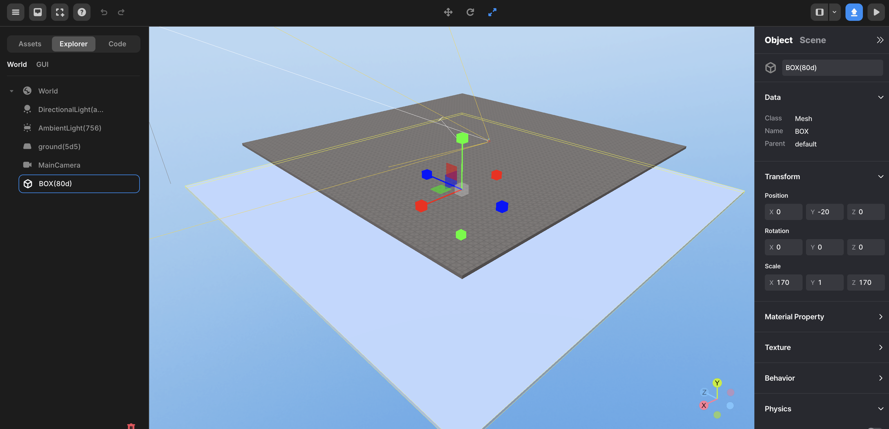
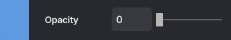
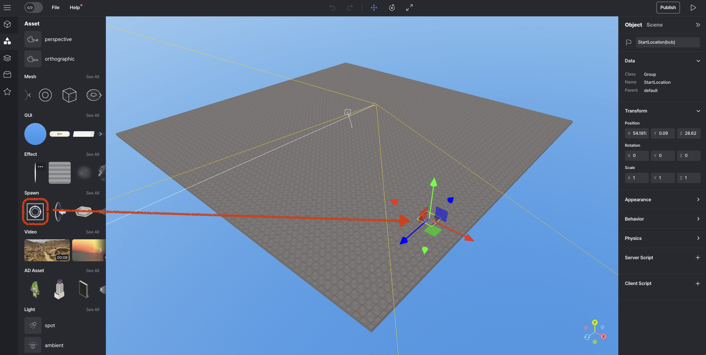
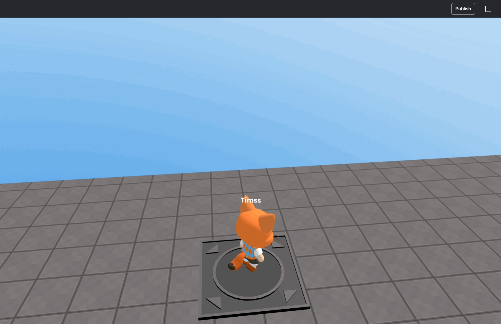

import { Callout } from "nextra/components";
import { Steps } from "nextra/components";
import { Tabs } from "nextra/components";

# Return to original position when it falls

<Callout type="info">
  For more information about `how to use avatar` can be found
  [here](./use-avatar)
</Callout>

<Tabs items={["example 1", "example 2"]} defaultIndex="0" >
    
    <Tabs.Tab>

        In this example you can make it by simply checking `avatar`'s `Y` position.

        ```js showLineNumbers copy filename="PresetScript" {1, 6, 15, 17}
        //intialize avater here
        let avatar;

        function Start() {
            (async () => {
                //store avatar into the `avatar`
                avatar = await REDBRICK.AvatarManager.createDefaultAvatar();
                const camera = WORLD.getObject("MainCamera");
                const followingCamera = avatar.setFollowingCamera(camera);
                avatar.setDefaultController();
            })();
        }

        function Update(dt) {
            //check if avatar exists
            if (avatar) {
                //respawn when avatar y position is less than -5
                if (avatar.position.y < -5){
                    avatar.spawn();
                }
            }
        }
        ```

    </Tabs.Tab>

    <Tabs.Tab>

        In this example you can make it by colliding to a mesh under your world.
        <Steps>

            ### Place object under your world
            Place the mesh where you want it and resize it. Check Body, and make sure Anchored is checked.

            <br/>
            <center> Place mesh, and check body & anchored </center>

            ### Make mesh transparent

            Use the Opacity to adjust the transparency.

            <br/>
            <center> Change Opacity </center>

            ### Create a place to return to its original location

            Click the Spawn that you want to create -> place a StartLocation

            <br/>
            <center> Create and place spawn location </center>

            ### Insert Code

            ```js showLineNumbers copy filename="PresetScript" {10}
            const spawnbox = WORLD.getObject("BOX(b5d)");

            function Start() {
                (async () => {
                    const avatar = await REDBRICK.AvatarManager.createDefaultAvatar();
                    const camera = WORLD.getObject("MainCamera");
                    const followingCamera = avatar.setFollowingCamera(camera);
                    avatar.setDefaultController();

                    // use here spawn related logic
                    spawnbox.onCollide(avatar, () => {
                        avatar.spawn();
                    });
                })();
            }
            ```

        </Steps>
    </Tabs.Tab>

    <br/>
    <center> Respawn </center>

</Tabs>
