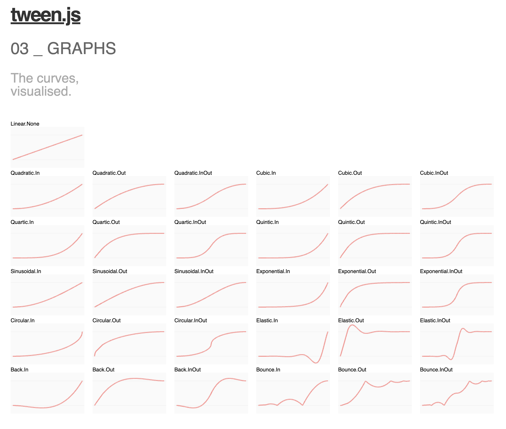

import { Callout } from "nextra/components";
import { Steps } from "nextra/components";
import { Tabs } from "nextra/components";

# Tips & Tricks

<Steps>

### Save Your Work as a File Whenever You Make Important Changes

_To avoid losing your project and to keep track of your progress, it is recommended to save as a file every time you make significant changes. Keep these files locally on your computer._

<Callout>

- This way, you can easily access previous versions and recover old code if needed.

- This is especially important if your internet connection is unstable.

</Callout>

### Please Use Assets from the Studio Asset Library

_To prevent lag and potential issues, it is recommended to use assets from the studio asset library. Using damaged or corrupted 3D assets can cause problems and may break your project._

<Callout>

Therefore, please use assets from the studio asset library or lightweight and simple 3D assets whenever possible.

</Callout>
### Animation Tricks

_To achieve high-quality results, it is better to use Tween for smooth animations._

```js showLineNumbers filename="Animation"
const start = { y: 0 }; // Initial Y position
const end = { y: 2 }; // Final Y position

const tween = new TWEEN.Tween(start)
    .to(end, 100) // Set duration
    .onUpdate(() => {
        object.position.y = start.y; // Update object's Y position
    })
    .easing(TWEEN.Easing.Quadratic.InOut) // Apply easing for smooth transitions
    .repeat(Infinity) // Repeat indefinitely
    .yoyo(true); // Reverse animation on each cycle
    .start(); // Initiate the animation
```

<Callout type="info">
  Tween Easing Visualized Graph
  <br />
  <div style={{ textAlign: "center" }}>
    <center> Tween easing graph</center>
  </div>
</Callout>

### Camera Movement Change in Edit Mode

If you find the default orbit camera movement difficult to control, press the `9` key to switch it.

<Callout type="warning">
Please note that, if you press `9` one more time it might move slowly. You can press it again to move normally.
</Callout>
</Steps>
