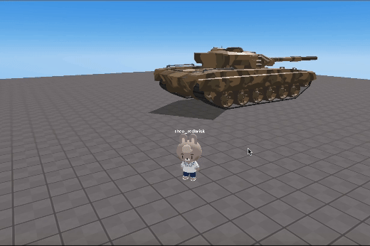
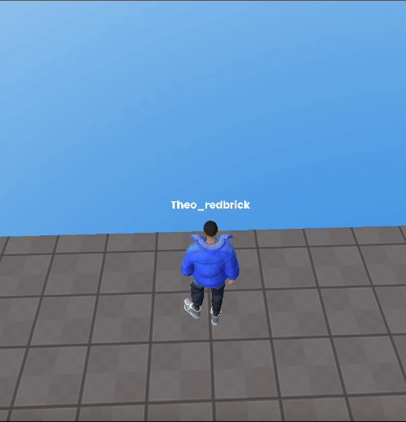

import { Steps, Callout } from "nextra/components";

## Update

### Update Date: `2024/07/24`

#### Additional Changes

- Added "MOUSE_LOCK" mode to the [`.useTPV()`](../script/api/perspective-camera#usetpv) method  
  The `useTPV()` method, which sets up a third-person view, now includes the "MOUSE_LOCK" mode.  
  This mode allows the camera to rotate simply by moving the mouse, as shown in the images below.  
  Additionally, this mode enables customization of camera settings.

  <Callout type="info">
  NORMAL mode vs. MOUSE_LOCK mode  
  <br/>
  | NORMAL | MOUSE_LOCK |
  |:------------------:|:---------------------:|
  |  |  |
  </Callout>
<br/>

- Added a falling animation for the RPM avatar.
<br/>
<center>
    
</center>
<br/>

- Added code formatting functionality to the script editor.
<br/>
<center>
  
</center>

- Added various [snippet examples](../snippet/management-multiple-similar-objects.mdx) to the wiki.

### Updated on `2024/05/30`

<Steps>

#### Additions

- Added control for player jump height using [`.changePlayerJumpHeight`](../script/api/avatar#changeplayerjumpheight).
- Introduced a clone feature to easily duplicate objects with the built-in method [`.cloneWithMethods()`](../script/api/object3d#clonewithmethods).
- Camera
  - Introduced a camera switch API with [`.activate()`](../script/api/perspective-camera#activate), which automatically enables the corresponding camera and disables all other cameras.
  - Added camera api to switch to first-person view [`.useFPS()`](../script/api/perspective-camera#usefps).
  - Added camera api to switch to third-person view, [`.useTPV()`](../script/api/perspective-camera#usetpv).
  - Added camera api to switch to VR, [`.useVR({ VRObject: PLAYER })`](../script/api/perspective-camera#usevr).
- OOBC
  - Added OOBC revive functionality.
  - Added GUI control for OOBC, including options for kill, revive, and move.
  - Added `setText` method to GUI for OOBC.
  - Added sprite thumbnail support for OOBC.

#### Improvements

- Adjusted the avatar's nickname sprite to track the currently enabled camera correctly.
- Corrected the avatar's WASD movement to follow the currently enabled camera accurately.
- Limited the maximum and minimum range for orbit control to prevent mouse issues.
- Fixed code editor autocomplete functionality.
- Updated the AI Assistant (GPT) UI.

</Steps>

## Version 1.1.1 `RECENT`

- Released on `2024/01/25`

<Steps>
### Additions

#### Global objects

- Added documentation for the [`PLAYER` global object](../script/start/global-objects#player)
- Added documentation for the [`GLOBAL` global object](../script/start/global-objects#global)

### Changes

For detailed information, please click [here](../engine/content-type)

#### Removal of `async` function in the Preset Script.

```jsx copy filename="new Preset Script"
const avatar = REDBRICK.AvatarManager.createDefaultAvatar();
const camera = WORLD.getObject("MainCamera");
const followingCamera = avatar.setFollowingCamera(camera);
avatar.setDefaultController();
```

</Steps>

## Version 1.1.0

<Steps>

### Removed

#### Global objects

Removed the `PLAYER` global object

### Changes

Updated the Preset Script to remove async function.

```jsx copy filename="version1.1.0 Preset Script"
function Start() {
  (async () => {
    const avatar = await REDBRICK.AvatarManager.createDefaultAvatar();
    const camera = WORLD.getObject("MainCamera");
    const followingCamera = avatar.setFollowingCamera(camera);
    avatar.setDefaultController();
  })();
}
```

</Steps>
