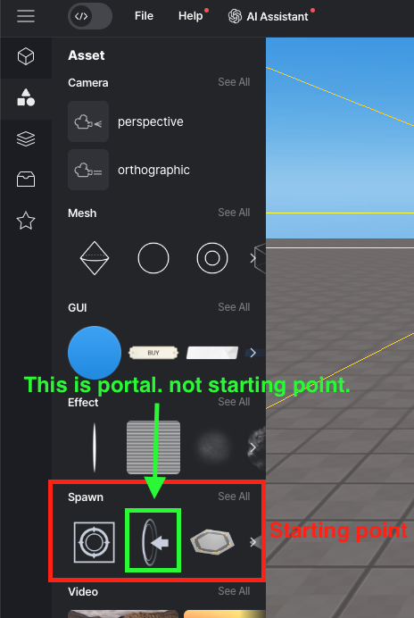

import {Callout} from "nextra/components";

# Avatar

> API that is added to the player's avatar.

The player (avatar) object also inherits from Object3D, so it can use the properties and methods of [Object3D](../built-in/three/object3d.mdx).

## Methods

### .spawn()

`.spawn(target) `

- target : object or the title of the object. Spawn to the location of that object. Defaulte is StartLocation.

The avatar moves to the location you specify.  
If no target is specified, you will move to `starting_point`.

<Callout type="warning">
To move to `starting_point`, the `starting_point` asset must exist within the scene.  
 

</Callout>

### .changePlayerSpeed()

`.changePlayerSpeed(speed) `

Change the speed of the avatar.

- speed : The avatar's speed, defaults is 1.

### .changeAxisSpeed()

`.changeAxisSpeed(x, y, z) `

Gives the avatar a default speed that is independent of player controls.

- x : Velocity per second in the x-axis direction.
- y : Velocity per second in the y-axis direction..
- z : Velocity per second in the z-axis direction.

### .changePlayerJumpHeight()

`.changePlayerJumpHeight(height) `

Change the jump height of the avatar.

- height : The avatar's jump height, defaults is 3.

### .setDefaultController()

`.setDefaultController`

Applies the default controller to the avatar for control.  
Using this method allows you to control the avatar's movement with `W, A, S, D, Space Bar`.

### .setFollowingCamera()

`.setFollowingCamera(camera)` : [PerspectiveCamera](../built-in/three/perspective.mdx)

Makes the specified camera automatically follow the avatar.

- camera: A [Perspective Camera](../../script/built-in/three/perspective.mdx) object that will follow the avatar.
