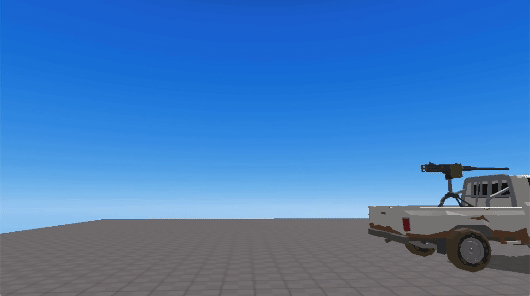

import {Callout} from "nextra/components"

# Perspective Camera

> APIs added to the camera object.

## Methods

### .activate()

Switches to the specified camera.

### .useFPS()

`.useFPS ()` : undefined

Sets the camera to FPS mode (first-person view).  

<br/>
<center>
 first-person view
</center>

### .useTPV()

`.useTPV(mode, setting)`: undefined

Sets the camera to third-person mode.

- **mode**: Defines the third-person view mode. Default is "NORMAL_MODE".
  - **"NORMAL_MODE"**: Default mode. Rotate the camera by dragging the screen with the mouse.
  - **"MOUSE_LOCK"**: Rotate the camera by moving the mouse without dragging.
<br/>
- **setting**: Configuration object for "MOUSE_LOCK" mode. Uses default values if not set.
  - **bottomClamp**: Lower pitch angle limit. Default: -15 degrees. The minimum value is -90.
  - **topClamp**: Upper pitch angle limit. Default: 70 degrees. The maximum value is 90.
  - **sensitivityX**: Horizontal rotation sensitivity. Default: 0.05.
  - **sensitivityY**: Vertical rotation sensitivity. Default: 0.05.
  - **cameraOffset**: Rotation pivot point relative to the avatar.
    - **x**: Default: 0.
    - **y**: Default: 5.
    - **z**: Default: 3.
  - **distance**: Distance from the cameraOffset point. Default: 3.
  - **zoom**: Camera zoom settings.
    - **scrollLock**: Enables/disables mouse wheel zoom. Default: true (disabled).
    - **minDistance**: Minimum zoom distance. Default: 5.
    - **maxDistance**: Maximum zoom distance. Default: 15.
  - **lookAtPoint**: Defines where the camera looks.
    - **target**: Default: "CAMERA_TARGET".
      - **"CAMERA_TARGET"**: Looks at the cameraOffset point.
      - **"AVATAR"**: Looks at the avatar.
    - **x**: Offset from the target. Default: 0.
    - **y**: Offset from the target. Default: 0.
    - **z**: Offset from the target. Default: 0.

<br/>

<center>
 "NORMAL_MODE". Rotate by clicking and dragging the screen.
<br/>
 "MOUSE_LOCK". Rotate by moving the mouse.
</center>


<Callout type="warning">
    `.useFPS()` and `useTPV()` require the avatar to have the `.setFollowingCamera()` method applied.
    
    Example usage:
    ```js showLineNumbers copy filename="camera_customizing"
    const avatar = REDBRICK.AvatarManager.createDefaultAvatar();
    const camera = WORLD.getObject("MainCamera");
    const followingCamera = avatar.setFollowingCamera(camera); //requires setFollowingCamera() to be applied to the avatar.
    avatar.setDefaultController();

    // In "MOUSE_LOCK" mode, you can customize values as shown below.
    // Unspecified values will use the default settings.
    camera.useTPV("MOUSE_LOCK", {
        distance: 20,
        cameraOffset: {
            z: 5,
            y: 7
        },
        sensitivityX: 0.2,
        topClamp: 90,
        zoom: {
            scrollLock: false
        }
    });
    ```
</Callout>


### .useVR()

`.useVR({ VRObject: object })` : undefined

Sets the camera to VR mode.  
For more details on VR options, refer to [this section](../../engine/content-type#vr-option).

- object: An [Avatar](../api/avatar.mdx) object or an [Object3D](../built-in/three/object3d.mdx) object
