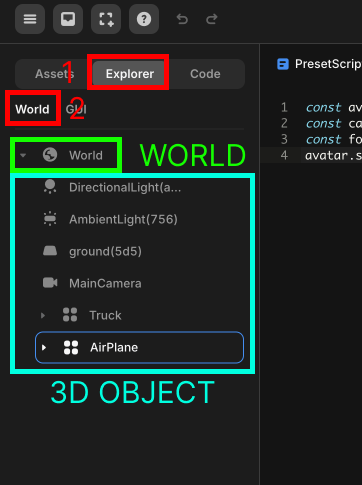

import { Callout } from "nextra/components";

# 3D & GUI Objects

> This guide explains 3D objects and GUI objects in Redbrick Studio.

In Redbrick Studio, objects are categorized into 3D objects and GUI objects.

## 3D Objects

3D objects exist within the 3D space of a game.  
These objects have three-dimensional properties and can interact with each other and the environment.  
Examples of 3D objects include:  
- Mesh: Shapes like cubes, spheres, and custom models created in 3D modeling software.
- Terrain: Landscapes or ground surfaces.
- Characters: Player or NPC character models.
- Objects: Various environmental elements like trees, buildings, and vehicles.

You can clearly distinguish between 3D objects and GUI objects in the object layer panel on the left side of the studio.  
Select the Explorer tab on the top panel, then select the World tab to see a list of 3D objects in the scene.

 
Object Layer World Tab

The object labeled as "WORLD" with a globe icon is the WORLD object.  
In scripts, `WORLD.getObject("object")` and `WORLD.add(object)` methods refer to this WORLD object.

## GUI Objects

GUI objects are elements that make up the user interface in Unity.  
They represent graphical elements for user interaction. Examples of GUI objects include:  
- Text: Text displayed on the screen.
- Button: Clickable interactive elements.
- Image: Graphics or icons displayed on the screen.

Select the Explorer tab on the top panel, then select the GUI tab to see a list of GUI objects in the scene.

 
Object Layer GUI Tab

The object labeled as "GUI" with a globe icon is the GUI object.  
In scripts, `GUI.getObject("object")` methods refer to this GUI object.

## Differences Between 3D Objects and GUI Objects

Let's add the image below to the scene as both a 3D object and a GUI object.

 
Example Image
 

### 3D Object

When added to the scene as a 3D object, the object becomes a child of WORLD and is rendered in the 3D space.

 

 

### GUI Object

When added to the scene as a GUI object, the object becomes a child of GUI and is rendered in the 2D space.  
Additionally, GUI objects remain in view even when the player changes the camera's direction.

 

 

