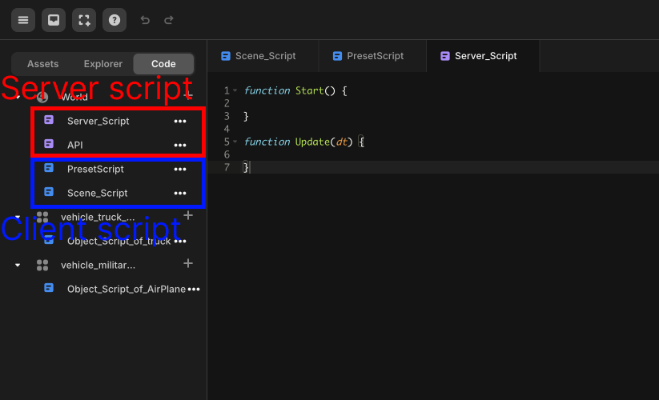

# Server Script & Client Script

> Provides information about server and client scripts.

Server Script runs on a multiplayer server, and Client Script runs on individual players' clients. If you don't create it in multiplayer, you don't need to write Server Script, you just write Client Script.
As the roles of Server Script and Client Script are different, there are also differences in the Event Function or Global Object that can be used within the script.

Server scripts are shown in red and client scripts are shown in blue, as depicted in the image below.
