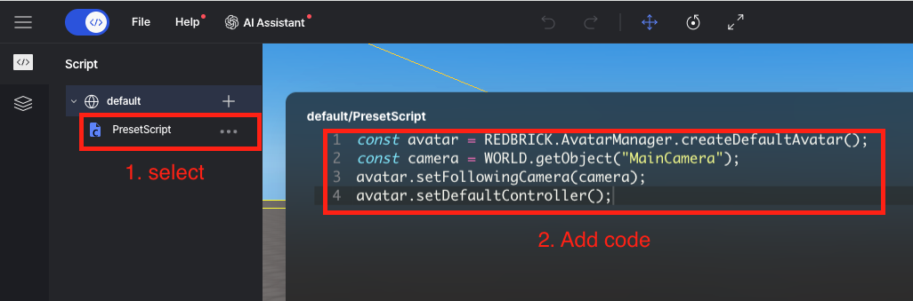

import { Callout } from "nextra/components";

# Avatar & Camera Basic Setup

> This guide covers the basic setup for avatars and cameras.  
If you want to use the avatar and camera without detailed adjustments, follow these steps.  

In the `PresetScript` script, which is created by default when you start a project, enter the following code:

```js copy showLineNumbers filename="PresetScript"
const camera = WORLD.getObject("MainCamera");
const avatar = REDBRICK.AvatarManager.createDefaultAvatar();
avatar.setDefaultController();
avatar.setFollowingCamera(camera);
```

<Callout type="info">
  <center></center>
</Callout>

With this setup, the camera will use third-person mode, and the avatar will be the one set on the Redbrick website.
For detailed settings on camera properties, FPS mode, TPV mode, etc., please refer to [this](../built-in/three/perspective) page.