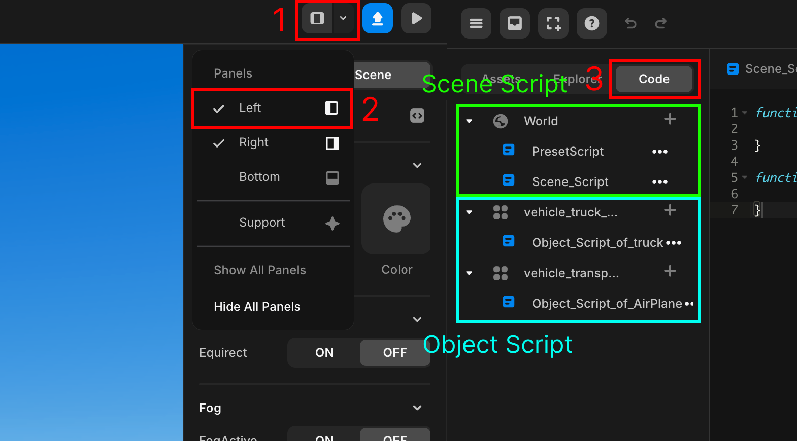
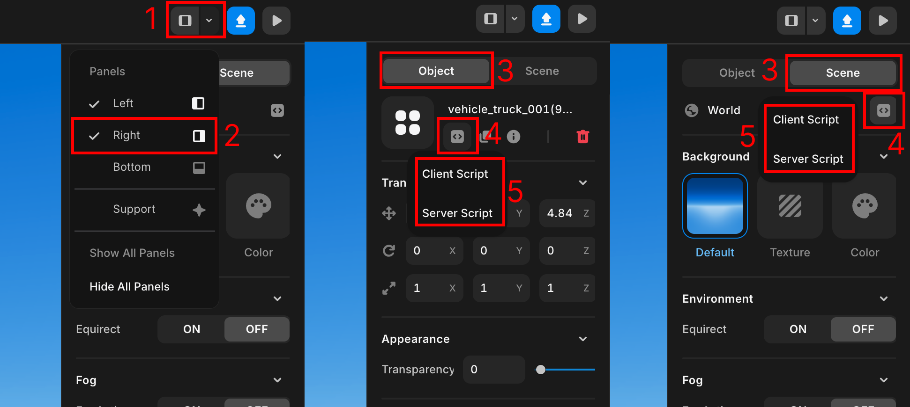
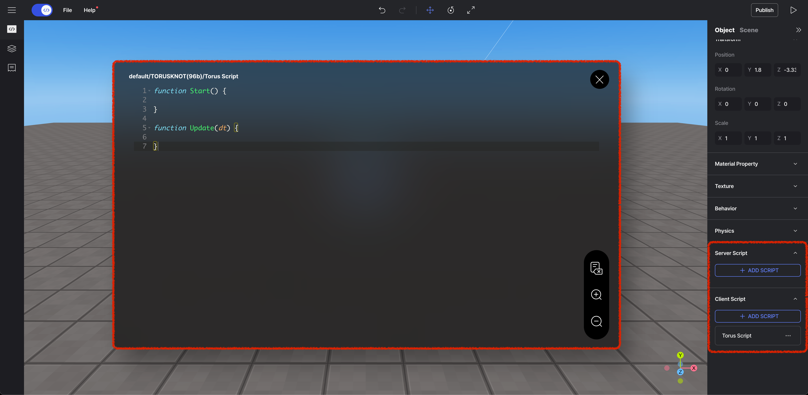

import { Callout } from "nextra/components";

# Object & Scene Scripts

> In Redbrick Studio, scripts are mainly divided into server scripts and client scripts.  
> This page focuses on the two types of client scripts.

If you are creating a single-player game, you will only use client scripts.  
Client scripts are further divided into object scripts and scene scripts.  
As their names suggest, these scripts are attached to objects and scenes, respectively.

When you use scene scripts, you need to manually specify the objects you want to access using methods like `getObject()`.

```js showLineNumbers filename="Scene Script"
const score_board = GUI.getObject("score_board"); // You need to manually specify the object to access
score_board.setText("100");
```

However, when using object scripts, you can directly access the object to which the script is attached using the `this` keyword.

```js showLineNumbers copy {2} filename="Object Script for GUI Object score_board"
this.setText("100"); // Directly access the object using 'this'
```

<Callout type="info">
  Click the button in the top left menu to view the list of all scripts, as shown in the image below.
  <br/>
  <center>
    
  </center>
  Scripts under the globe icon (Scene) are scene scripts,  
  while scripts under other objects are object scripts.
</Callout>

## Scene Scripts

Scene scripts are used to control and manage the entire scene. They define the overall logic and flow within the scene.  
Typically, they handle initialization, settings, interactions, and event processing for the scene.  
For example, you can use scene scripts to place certain objects when the scene starts or to detect and handle events occurring within the scene.

```js copy showLineNumbers filename="EX_Scene_Script"
const timer = new REDBRICK.Timer();
const score = 0;

function game_start(){
  timer.reset();
  timer.start();
  score = 0;
}

function Start(){
  game_start();
  REDBRICK.Signal.addListener("score_operation", function(value) {
    score += value;
  })
}
```

## Object Scripts

Object scripts are used to control and manage individual objects. They define unique behaviors and interactions for each object.  
For example, you can attach an object script to a specific object to control its behavior, movement, animations, and interactions in detail.

```js showLineNumbers copy filename="EX_Object_Script"
function Start(){
  this.onCollide(PLAYER, function() {
    REDBRICK.Signal.send("score_operation", 1);
    this.kill();
  });
}
```
  
## Editing Scene & Object Scripts

<Callout type="info">
  You can add, edit, or delete object and scene scripts from the property panel. You can also rename the scripts.
  <br />
  <center></center>
  <br/>
  <center></center>
</Callout>