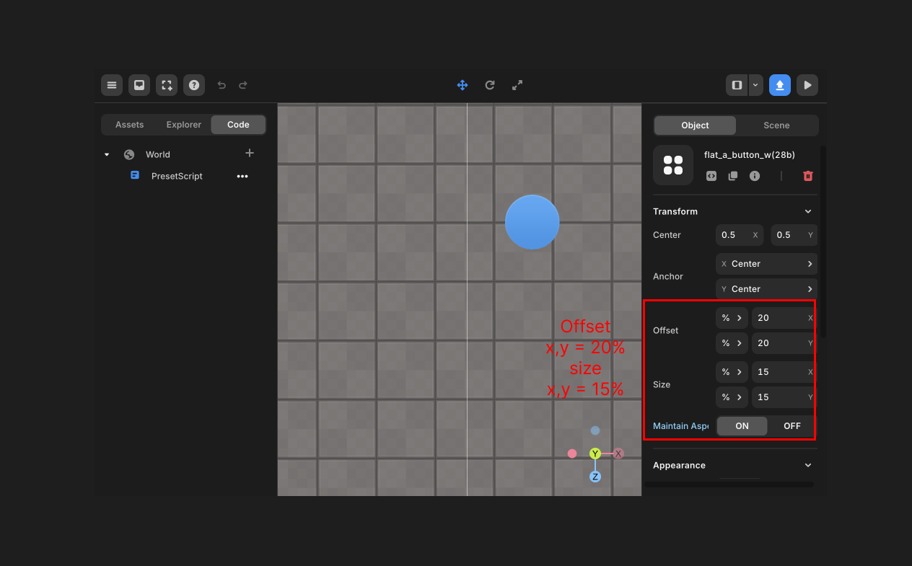

---
import { Callout } from "nextra/components";

# px and % Units

> Here's a guide on the difference between % and px.

The Offset and Size properties of Redbrick Studio GUI objects can be set to either px or %.  
Let's explore the differences between these two units.

## px

Pixels are an absolute unit based on the physical pixel count of the screen. One pixel represents one point on the screen.  
If you select px as the unit, the object will always have a fixed size and position.

Let's create a GUI object and set the Offset to 200px for both x and y, and the Size to 100px for both x and y.  
The results after changing the screen size are as follows:

 
Screen size 1280x800

 
Screen size 1024x600

The GUI object's size and position remain the same regardless of the screen size.  
Thus, when the screen size is smaller, the object stays fixed at the same position, causing the right end to be cut off.

## percent

Percent is a relative unit based on the size of the parent element.  
For example, setting x to 50% means half the size of the parent's x.

In the following example, the Offset is set to 20% for both x and y, and the Size is set to 15% for both x and y.

 
Screen size 1280x800

 
Screen size 1024x600

When using %, the object maintains its proportion regardless of the screen size.  
Therefore, as the screen size gets smaller, the GUI object's size and position adjust accordingly to fit the smaller screen.  
When the GUI object is a child of a globe-shaped parent GUI object, it will base its size and position on the browser's screen size.