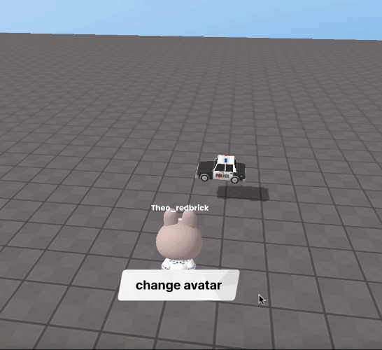

import { Callout, Code } from "nextra/components";
import { Steps } from "nextra/components";
import { Tabs } from "nextra/components";

# Changing Avatar Appearance

<center>
<br/>

</center>

You can make the player's avatar invisible and add another object as a child of the player to create the appearance of changing the avatar.

<Callout type="warning">
  Make sure to add the avatar you want to change to the scene in advance.
</Callout>

```js showLineNumbers copy filename="change_avatar"
const obj = WORLD.getObject("obj");  // Object to use for the new appearance
const btn = GUI.getObject('btn');

btn.onClick(function() {
    PLAYER.children[0].visible = false; // Hide the player avatar
    PLAYER.add(obj); // Add the object as a child of the player
    obj.position.set(0, 0.5, 0); // Set the object's position
})
```