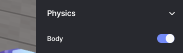
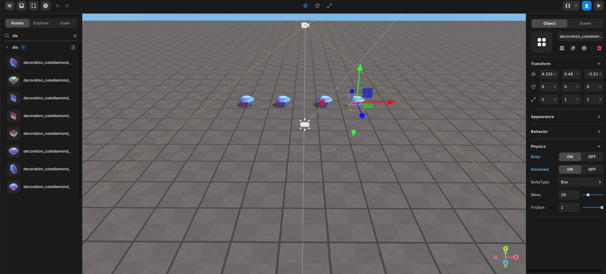

import { Callout } from "nextra/components";
import { Steps } from "nextra/components";
import { Tabs } from "nextra/components";

# Collect Items

<Steps>

### Place objects wherever you want

    Place the items wherever you want.
    <Callout type="info">
        It's hard to stay organized when you have a lot of items, so it's a good idea to make the title easier to read.
    </Callout>
    <Callout type="error" icon="‼️">
        Don't forget to check Body in the object's properties panel to use methods like `onCollide`!
        <center>
        
        Physics -> Body
        </center>
    </Callout>

    <br/>
    <center> Place items </center>

### Code

<Callout type="info">
  For more information about `how to use avatar` can be found
  [here](./use-avatar)
</Callout>

<Tabs items={["example 1", "example 2"]} defaultIndex="0">
    <Tabs.Tab>
        <Callout type="info">
            Here's a basic example of how to do it. For an enhanced solution, refer to Example 2 👉🏼.
        </Callout>
        ```js showLineNumbers filename="PresetScript" {1-5, 14-28}
        const diamond0 = WORLD.getObject("diamond0");
        const diamond1 = WORLD.getObject("diamond1");
        const diamond2 = WORLD.getObject("diamond2");
        const diamond3 = WORLD.getObject("diamond3");
        const diamond4 = WORLD.getObject("diamond4");

        function Start() {
            (async () => {
                const avatar = await REDBRICK.AvatarManager.createDefaultAvatar();
                const camera = WORLD.getObject("MainCamera");
                const followingCamera = avatar.setFollowingCamera(camera);
                avatar.setDefaultController();

                diamond0.onCollide(avatar, () => {
                    diamond0.kill();
                });
                diamond1.onCollide(avatar, () => {
                    diamond1.kill();
                });
                diamond2.onCollide(avatar, () => {
                    diamond2.kill();
                });
                diamond3.onCollide(avatar, () => {
                    diamond3.kill();
                });
                diamond4.onCollide(avatar, () => {
                    diamond4.kill();
                });

            })();
        }
        ```
    </Tabs.Tab>
    <Tabs.Tab>

        Here's a slightly improved example of usage, minimizing redundant lines.

        ```js showLineNumbers filename="PresetScript" {9, 17, 19-21}
        function Start() {
            (async () => {
                const avatar = await REDBRICK.AvatarManager.createDefaultAvatar();
                const camera = WORLD.getObject("MainCamera");
                const followingCamera = avatar.setFollowingCamera(camera);
                avatar.setDefaultController();

                //call function
                collisionSetUp(avatar);

            })();
        }

        function collisionSetUp(avatar) {
            // 5 diamonds
            for (let i = 0; i < 5; i++) {
                const diamond = WORLD.getObject("diamond" + i);

                diamond.onCollide(avatar, () => {
                    diamond.kill();
                });
            }
        }
        ```
    </Tabs.Tab>

</Tabs>

</Steps>
