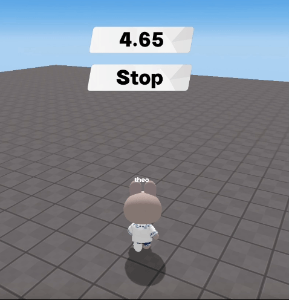

import { Callout, Code } from "nextra/components";
import { Steps } from "nextra/components";
import { Tabs } from "nextra/components";

# Creating Function to Pause the Game

<center>
<br/>

</center>

Currently, Redbrick Studio does not have a dedicated function to pause the game.  
However, you can achieve a similar effect with a custom function.  
Define a function to pause the game, and use that function whenever you need to pause the game.  

```js showLineNumbers filename="example game pause" {13-17, 19-22}
const timer = new REDBRICK.Timer();
const timer_board = GUI.getObject("timer_board");
const pauseButton = GUI.getObject("pause_button");
const playButton = GUI.getObject("play_button");

function Start(){
  timer.start();
}

function Update(dt) {
  timer_board.setText(timer.getTime())
}

function gamePause() { // Function to pause the game
  PLAYER.changePlayerSpeed(0);
  timer.pause();
  // Add other parts that need to be paused
};

function gamePlay() { // Function to resume the paused game
  PLAYER.changePlayerSpeed(1);
  timer.resume();
};

pauseButton.onClick(() => {
  gamePause(); // Pause the game
});

playButton.onClick(() => {
  gamePlay(); // Resume the game
});
```
