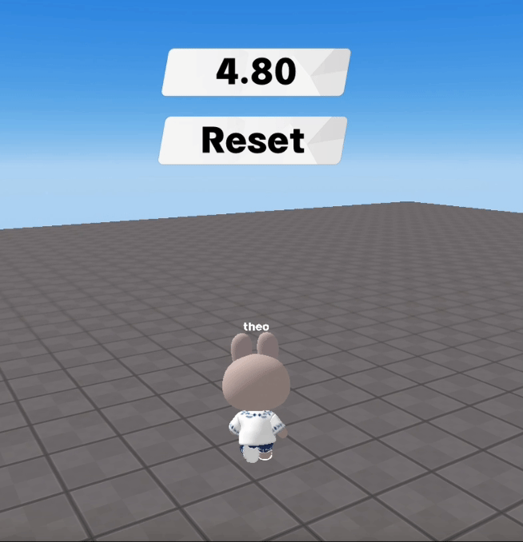

import { Callout, Code } from "nextra/components";
import { Steps } from "nextra/components";
import { Tabs } from "nextra/components";

# Creating a Function to Reset the Game

<center>
<br/>

</center>

Currently, Redbrick Studio does not have a dedicated function to restart or reset the game.  
However, you can achieve a similar effect with a custom function.  
Define a function to reset the game, and use that function whenever you need to reset the game.  

```js showLineNumbers filename="example restart" {6-11, 18-20}
const timer_board = GUI.getObject("timer_board");
const reset_btn = GUI.getObject("reset_btn");
const start_btn = GUI.getObject("start_btn");
const timer = new REDBRICK.Timer();

function reset() { // Function to reset the game
  PLAYER.spawn();
  timer.reset();
  timer.start();
  // Add other parts that need to be reset or configured
}

start_btn.onClick(() => {
  timer.start();
  reset(); // Reset the game when starting
});

reset_btn.onClick(() => {
  reset(); // Reset the game when pressing the reset button
});

function Update(dt) {
    timer_board.setText(timer.getTime())
}
```
