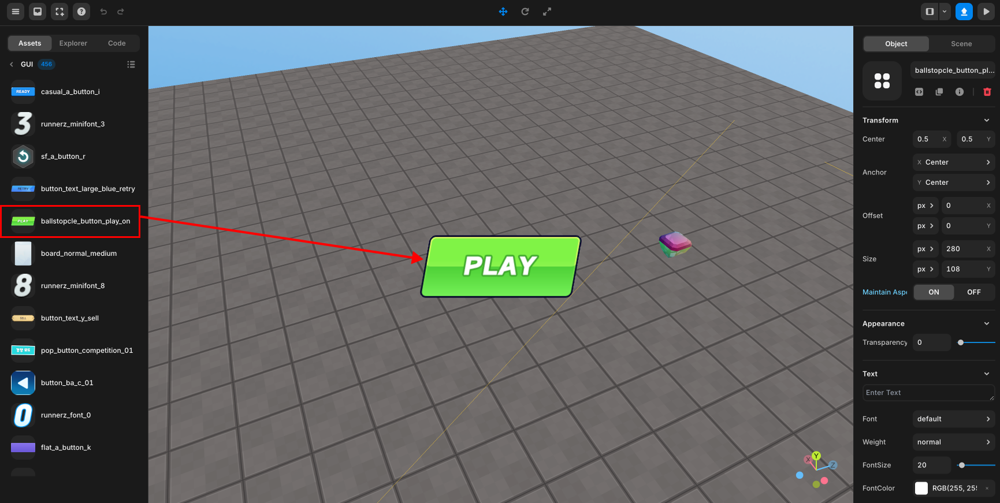

import { Callout } from "nextra/components";
import { Steps } from "nextra/components";
import { Tabs } from "nextra/components";

# Create a Game Start button

<Steps>

### Select the start button you want

Click the + button in the upper left -> GUI -> Select the start button you want

<br />
<center>
   Select Start Button{" "}
</center>

### Code

```js howLineNumbers copy filename="otherScript"
const startbtn = GUI.getObject("ballstopcle_button_play_on(e77)");

function Start() {
  startbtn.onClick(() => {
    startbtn.hide();
  });
}
```

If the script above is part of a start button script, it could be written as follows:

```js howLineNumbers copy filename="ballstopcle_button_play_on(e77)"
function Start() {
  this.onClick(() => {
    this.hide();
  });
}
```

</Steps>
