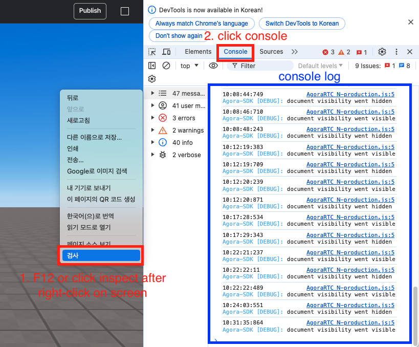
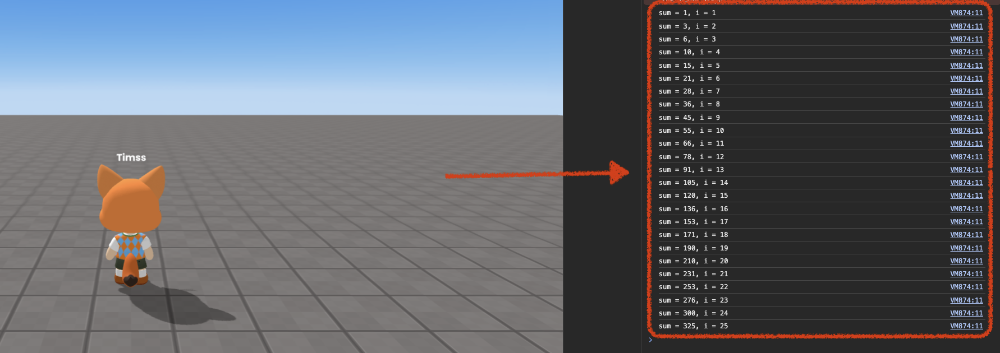
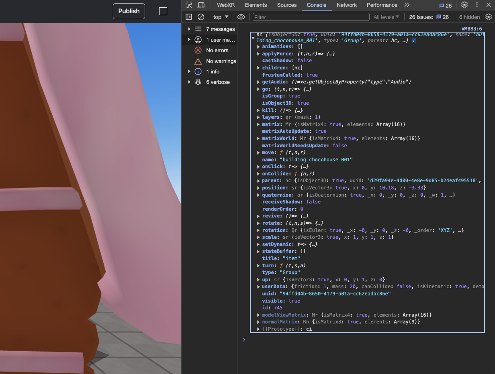
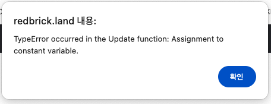

import { Callout } from "nextra/components";
import { Steps } from "nextra/components";
import { Tabs } from "nextra/components";

# How to Debug and Fix Errors

There are several ways to identify and resolve errors.

<Steps>

### Console

If something is not working, you can use `console.log()` to check if the relevant part of the code is functioning correctly.

<Callout type="info">
    How to open the console
    <br/>
    <center> Press F12 or right-click on the browser screen and select Inspect -> Select the Console tab in the top of the opened console window</center>
</Callout>

Note:
1. Checking the console after an error occurs may not display the error's details. To see the error details in real-time, test the game with the console window open.
2. Some errors displayed in the console may not be related to the Redbrick engine or may not affect gameplay. Not every error message in the console indicates a problem.

<Tabs items={["example 1", "example 2"]} defaultIndex="0">

    <Tabs.Tab>
        ```js showLineNumbers copy {6}
        let sum = 0;

        // Sum until 25
        for (let i = 1; i <= 25; i++) {
            sum += i;
            console.log(`sum = ${sum}, i = ${i}`);
        }

        ```

        <br />
        <center> Console result </center>

    </Tabs.Tab>

    <Tabs.Tab>

    You can also check objects and their properties. Here is an example to explain this in more detail.

     ```js showLineNumbers copy {6}
        const item = WORLD.getObject("item");

        console.log(item);

        ```

        <br />
        <center> Console result </center>
    </Tabs.Tab>

</Tabs>

### Error Popups

<Callout type="info">
  Error Popup
  <br/>
  <center> Error popup displayed when an error occurs</center>  
</Callout>

Note:
Error popups do not always appear when an error occurs.  
If no error popup is displayed, check the console window.

### Save and Reopen the Project

If you believe everything is correct and cannot find the error, use the "Save as File" option to save the project as a `.json` file.

Then create a new project and use "Open from File" to load the saved file.

Finally, run the project again to see if the issue is resolved.

<Callout type="error">
  If it still doesn't work, reach out through the [Discord channel](https://discord.com/invite/redbrick-create).
</Callout>
</Steps>
