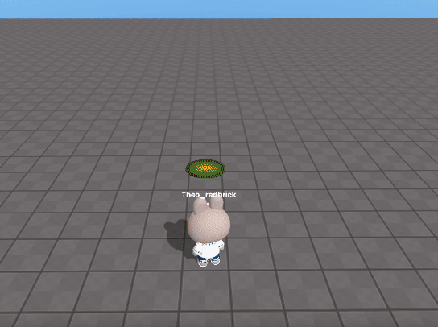
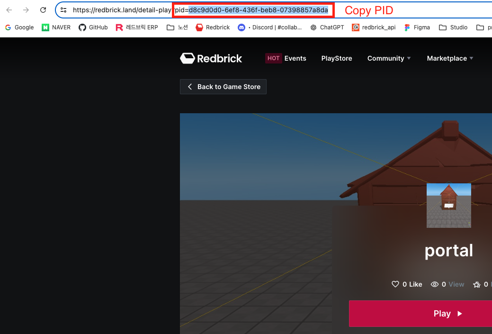
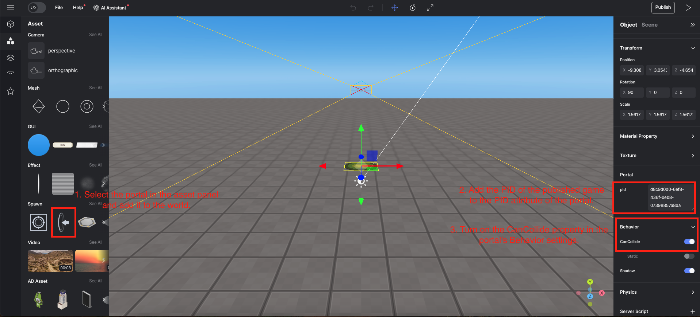

import { Callout, Code } from "nextra/components";
import { Steps } from "nextra/components";
import { Tabs } from "nextra/components";

# Switching to Another Game Using a Portal

## Steps

<Steps>

<Callout type="warning">
  You can only switch to a game that has been published.  
</Callout>

### Copy the PID of the game you want to switch to.  

1. Go to the page of the published game you want to switch to.  
2. Copy the PID from the address bar of that game.  
 

### Add a portal to the world and set its properties.  

1. Select the portal in the asset panel on the left side of the editor and add it to the world.  
2. Enter the copied PID into the portal's pid attribute.  
3. Turn on the CanCollide property in the portal's Behavior settings.  
 

### Interact with the portal in the game

When you run the game and interact with the portal, you will switch to the other game.  

</Steps>
