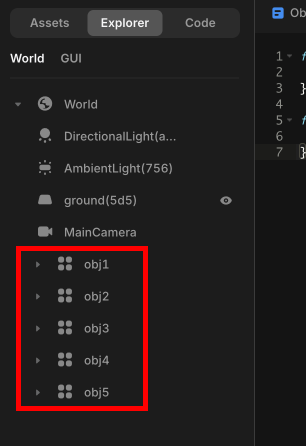

import { Callout, Code } from "nextra/components";
import { Steps } from "nextra/components";
import { Tabs } from "nextra/components";

# Managing Multiple Similar Objects

<center>
<br/>

</center>

When managing multiple objects with the same or similar logic, you can name the objects sequentially as shown in the picture below and use a for loop to easily retrieve them.

<center>
<br/>

</center>

```js copy showLineNumbers filename="similar-objects"
let objs = []; // An array to manage the objects

// Use a for loop to retrieve objects with sequential names
for(let i=1; i<=5; i++){
    objs.push(WORLD.getObject("obj" + i)); 
    
    // Allow each retrieved object to perform collision detection with onCollide
    objs[i-1].onCollide(PLAYER, function() {
        objs[i-1].kill()
    })
}
```
