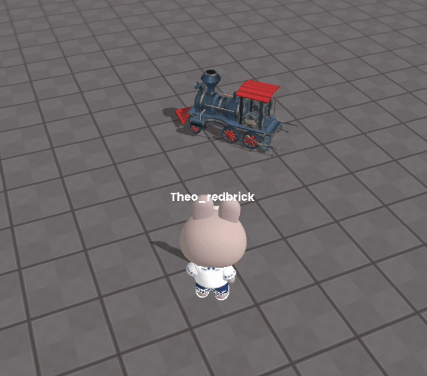

import { Callout, Code } from "nextra/components";
import { Steps } from "nextra/components";
import { Tabs } from "nextra/components";

# Continuously Rotating Object

<center>
<br/>

<br/>
</center>

This can be implemented easily as follows:

```js copy showLineNumbers filename="rotation"
const SPEED = 5;

const obj = WORLD.getObject('obj');

function Update(dt){
    obj.rotation.y += dt * SPEED;
    
    // If the Physics Body property of the object is enabled, you need to execute the following code.
    // obj.body.needUpdate = true;
}
```
