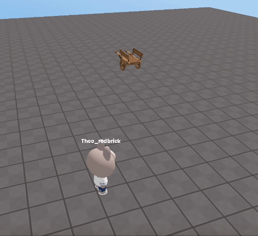

import { Callout, Code } from "nextra/components";
import { Steps } from "nextra/components";
import { Tabs } from "nextra/components";

# Setting a Random Position

<br />
<center> Example</center>

Let's see how to set a random position within a specific range.  
In this example, the object is moved to a random position every 0.5 seconds.

```js showLineNumbers copy filename="random_position"
// Define the range to get random values within MIN:minimum value, MAX:maximum value
const X_RANGE = {"MIN" : 10, "MAX" : 20};
const Y_RANGE = {"MIN" : 1, "MAX" : 5};
const Z_RANGE = {"MIN" : 10, "MAX" : 20};

const obj = WORLD.getObject("obj");

// Move the object to a random position within the range every 0.5 seconds.
setInterval(function() {
  const random_x = Math.floor(Math.random() * (X_RANGE.MAX - X_RANGE.MIN + 1)) + X_RANGE.MIN;
  const random_y = Math.floor(Math.random() * (Y_RANGE.MAX - Y_RANGE.MIN + 1)) + Y_RANGE.MIN;
  const random_z = Math.floor(Math.random() * (Z_RANGE.MAX - Z_RANGE.MIN + 1)) + Z_RANGE.MIN;
  
  obj.position.set(random_x, random_y, random_z);
}, 500);
```