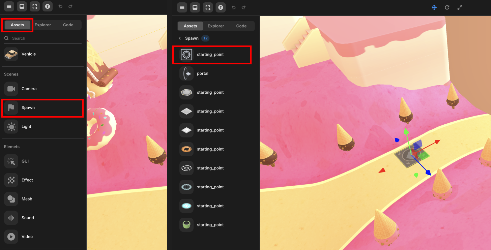
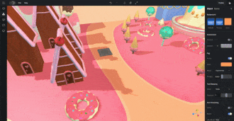

import { Callout } from "nextra/components";
import { Steps } from "nextra/components";
import { Tabs } from "nextra/components";

# Set the Starting Point

> Provides instructions on how to set the position of avatar appearance in the completed world.

When the world is complete, you must finally set the appearance position of the avatar.

<Callout type="info">
  If you're looking to return to your original position and need guidance, you
  can follow this [guideline](./respawn).
</Callout>

<Steps>
###  Import Starting Point

- Import the Starting Point from the Asset Library > Spawn menu.

 

 Starting Point 

### Place Starting Point

- Position the Starting Point where you want the Avatar to appear.
- At this point, you can change the rotation property among the transform properties of the starting point to set the angle of view when the avatar appears.

 

  {" "}
   Place Starting Point

### Play

- Press the Play button and experience the world.

 

 Play Mode 

</Steps>
