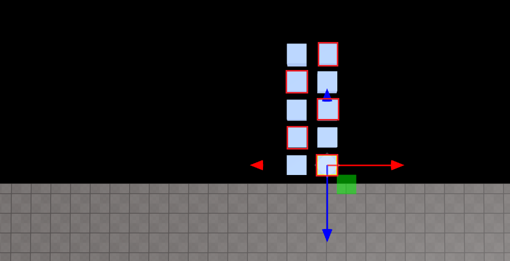

import { Callout } from "nextra/components";
import { Steps } from "nextra/components";
import { Tabs } from "nextra/components";

# Making a stepping stone that disappears when you step on it

<Steps>

### Place objects wherever you want

Create a stepping stones and rename the title of the stones that should disappear.

<br />
<center> Put Stepping Stones</center>

<Callout type="error" icon="‼️">
  Don't forget to check Body in the object's properties panel to use methods
  like `onCollide`!
  <center> Physics -> Body</center>
</Callout>

### Code

```js showLineNumbers copy
const falseboxes = [];
for (let i = 0; i < 5; i++) {
  falseboxes[i] = WORLD.getObject("falsebox_" + i);
}

function Start() {
  falseboxes.forEach((box) => {
    box.onCollide(PLAYER, () => {
      box.kill();
      setTimeout(() => {
        box.revive();
      }, 1000);
    });
  });
}
```

<br />
<center> Result</center>
</Steps>
