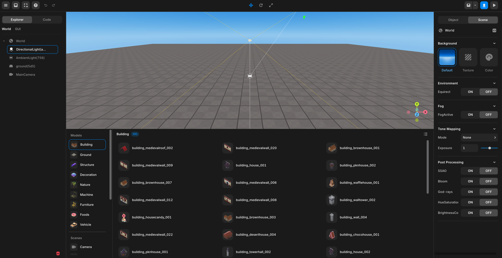

import { Cards, Card } from "nextra/components";

# Toolbars & Panels

 

 Engine View

 

<Cards>
  <Card title="Top Panel" href="/engine/operate/top" />
  <Card title="Asset Library Panel" href="/engine/operate/left" />
  <Card title="Property Panel" href="/engine/operate/right" />
</Cards>
