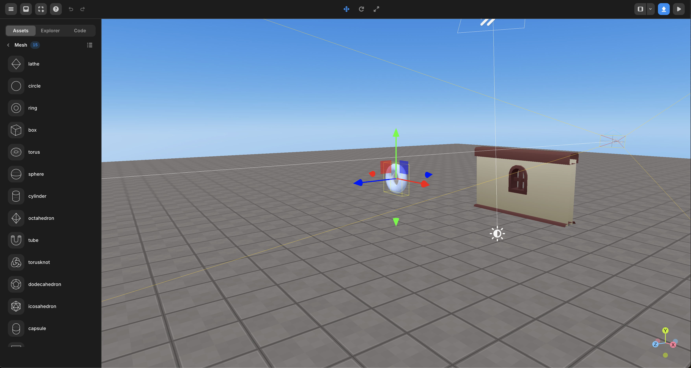
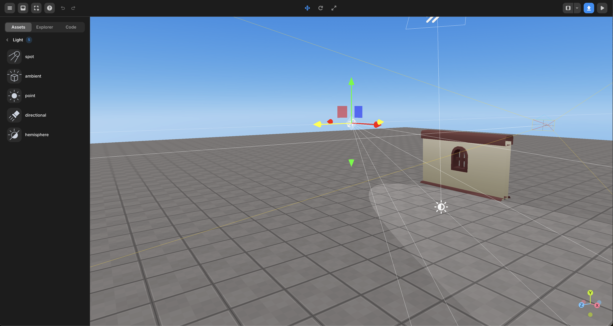
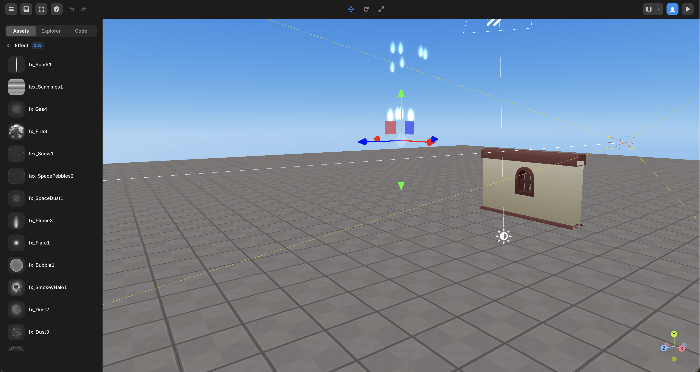
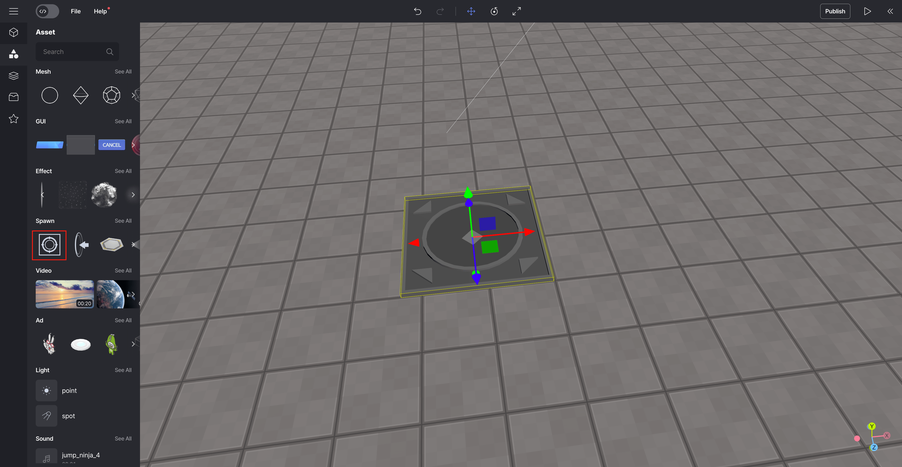

# Assets

## Mesh

Mesh refers to the basic geometry provided by the studio.

You can complete your own object by using several basic shapes.

 

 Mesh

## GUI

GUI stands for Graphic User Interface, an interface that helps users input and output comfortably within the world.

You can write scripts and use them in various ways, such as buttons and timers.

 

 GUI

## Video

Provides flat (2-dimensional) video that can be played within the world. You can click to preview the video, and you can add video objects to the world by dragging them into the world.

The video is played when you enter play mode.

 

 Video

## Sound

A variety of background music and sound effects are available. You can click to preview the sound, and you can add sound objects to the world by dragging them into the world.

You can create a script so that sound plays only in certain situations.

 

 Sound

## Light

A light object that can be added within the world is provided.

With Light, you can create various looks.

 

 Light

## Effect

Various particle effects are available.

You can set the color, speed, etc. to create an effect.

 

 Effect

## Spawn

When entering play mode, a tile that sets the appearance position of the avatar and a portal to move to another game are provided.

 

 Spawn

You can adjust the position of the tile to set the appearance position of the avatar.

 

   Starting point

## AD Asset

Provides an asset for the advertisement to go up.

 

 AD Asset

## Camera

You can add two type of cameras to the scene, perspective and orthographic.

 

   Camera Asset

