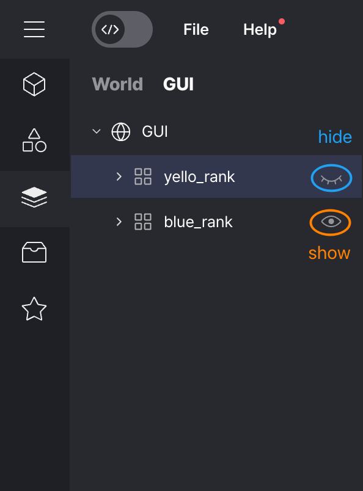
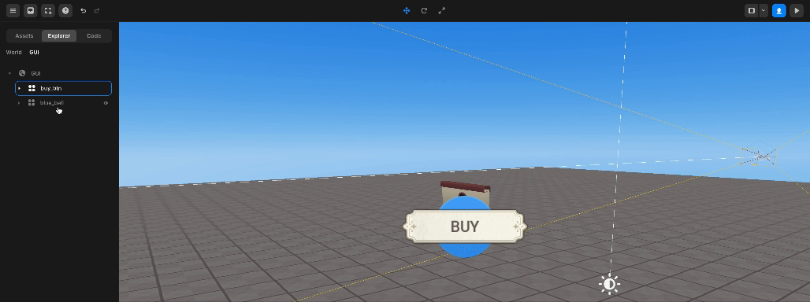

# Layer

## Select Object / GUI

You can select an object by clicking on it.

## Show & Hide Object / GUI

You can left-click an object or GUI to make it invisible.

You can click it again to make the object or GUI visible.

The hide/show feature is automatically applied to child objects.

 

 Hide & Show

## Reorder Object / GUI

You can change the order of objects / GUIs by dragging them on the Asset layer and moving them to the desired location.

For objects, the order is meaningless, but for GUIs, the bottommost GUI will be the most visible on the screen and will be selected first when clicked.

 

 Reorder

## Include as a subgroup / Remove from group

By dragging and moving specific objects / GUIs on an asset layer, it is possible to include objects or GUIs as children of other elements or separate them from their parents.

 

   Include as a subgroup / Remove from group

