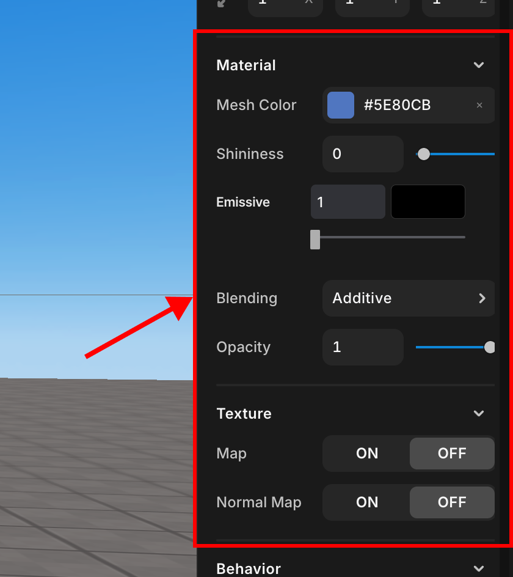

# Material & Texture

> You can adjust the color, gloss, texture settings, and transparency of mesh objects.

 

   Material& Texture

## Material

- **MeshColor**: A color picker for setting the mesh's base color.
- **Shininess**: A slider to adjust the surface's shininess.
- **Emissive**: A slider to control the material's light emission.
- **Blending**: A dropdown menu for selecting the blending mode with the environment.
- **Opacity**: A slider for changing the material's opacity.

## Texture

- **Map**: Toggle for applying a texture map. The `+` icon is for uploading a custom texture, while the central button might be for selecting a predefined texture. The left button is used to apply the chosen texture.
